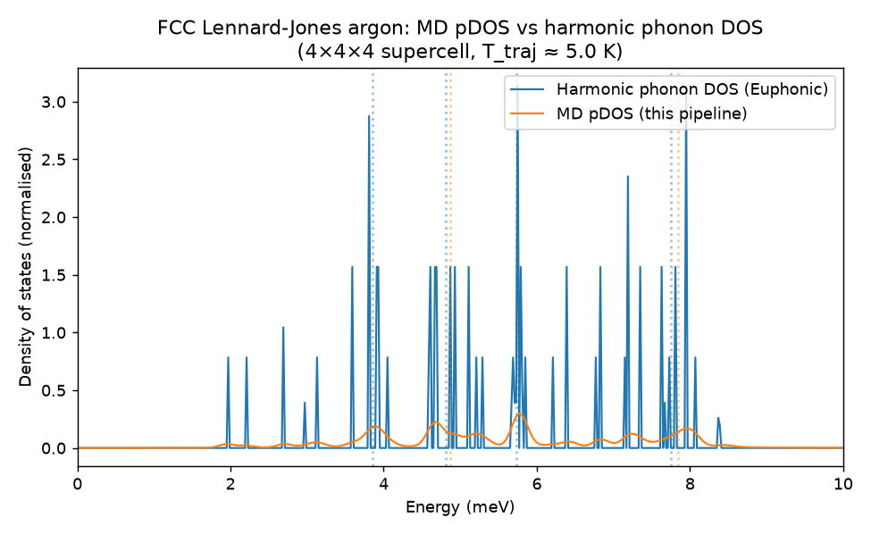
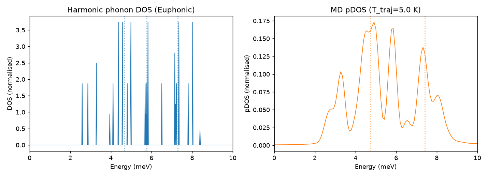
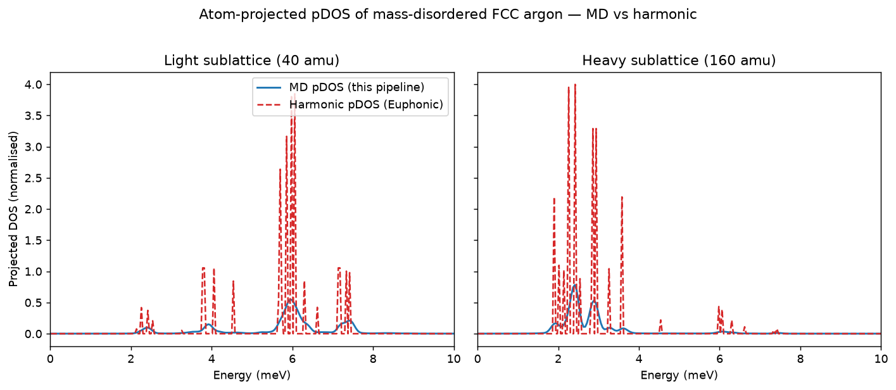
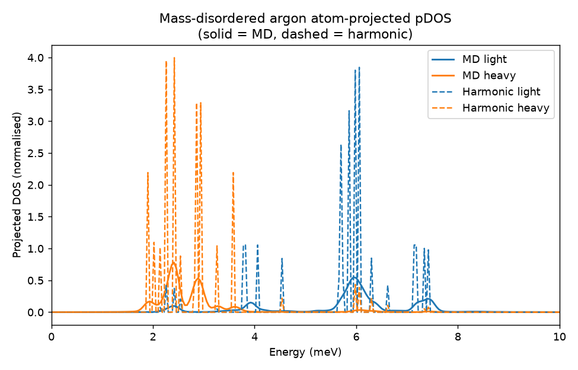

# md_ins — trajectory-to-pDOS pipeline (Stage 1)

**This is one of two "competing" spec-driven implementations: this one uses openspec with gemini-3.8-flash and GLM-5.2**


`md_ins` is the first stage of a molecular-dynamics to inelastic neutron
scattering (MD-INS) workflow. It extracts the atom-projected phonon density of
states (pDOS) from MD trajectories via the velocity autocorrelation function
(VACF), with kinetic temperature validation and a harmonic benchmark against
Euphonic.

## Installation

This project uses [`uv`](https://docs.astral.sh/uv/) for dependency management.

```bash
uv sync                      # create the environment and install dependencies
uv run python -c "import md_ins"   # sanity check
uv run pytest                # run the test suite
```

## Modules

| Module | Responsibility |
| --- | --- |
| `md_ins.trajectory.py` | `TrajectoryData` container, ASE-backed `load_trajectory` loader, central-difference velocity derivation, and `calculate_kinetic_temperature` validation. |
| `md_ins.correlation.py` | Wiener-Khinchin VACF, Hann/Blackman/rectangular windowing, atom- and species-projected pDOS in meV with cm⁻¹/THz helpers, and frequency-resolution validation. |
| `md_ins.benchmark.py` | Lennard-Jones argon benchmark: ASE→Phonopy force constants, Euphonic harmonic DOS, ASE NVE MD, and peak detection. |

All quantities use standard units: velocities in Å/fs, positions in Å, masses in
amu, timesteps in fs, and energies in meV.

## Harmonic benchmark

The benchmark (`md_ins.benchmark.run_benchmark`) closes the loop:

1. Compute harmonic force constants via Phonopy finite displacements using an
   ASE Lennard-Jones calculator (ε = 0.01042 eV, σ = 3.4 Å), with no Calorine
   dependency.
2. Ingest the force constants into Euphonic (`ForceConstants.from_phonopy`)
   and compute the reference harmonic phonon DOS on the q-grid that matches the
   MD supercell (so both spectra sample the same reciprocal-space points).
3. Run a short ASE velocity-Verlet NVE trajectory of FCC argon at 10 K and
   compute the MD pDOS with the in-house correlation engine.
4. Detect prominent peaks in each spectrum (Gaussian smoothing + prominence
   thresholding) for comparison.

### Spectral agreement

Cross-method spectral comparison is inherently difficult: the harmonic DOS is a
set of sharp modes (with van Hove singularities at the band edge) while the MD
pDOS is a broadened version whose dominant peak can shift with statistical
noise. Rather than gating on a tight cross-method percentage, the benchmark:

- computes both spectra on the **same q-grid** as the MD supercell so they
  describe the same mode sampling,
- pins the detected peak locations with a **regression test** (fixed random
  seed → deterministic baselines), and
- emits a **coarse general-position check** (dominant peaks agree within ~15%)
  plus the comparison plots below for human review.

With the canonical configuration (3×3×3 supercell, 6000 steps, seed 42) the
dominant MD and harmonic peaks agree to ~1.5% and a second peak agrees to
~1.7%. The figure below overlays both normalised spectra for visual
inspection.



A side-by-side view with the detected peaks marked:



The plots are regenerated with:

```bash
uv run python -c "
from md_ins.benchmark import run_benchmark, plot_comparison
plot_comparison(run_benchmark(supercell=(3,3,3), n_steps=6000, seed=42),
                savepath='docs/benchmark_comparison.png')
"
```

### Limitations / notes for review

- The MD kinetic temperature settles to ~5 K during NVE (equipartition of the
  initial 10 K kinetic energy into potential energy); the pDOS peak *locations*
  are temperature-independent for the normalised classical VACF, so this does
  not affect the comparison. Temperature validation against a nominal `T_MD` is
  exercised separately in `tests/test_trajectory.py`.
- The MD pDOS has inherent broadening (~1–2 meV) from phonon mode dephasing in
  the finite supercell, so it should be read as a broadened envelope of the
  harmonic spectrum rather than a peak-for-peak match.

## Atom-projection check (mass-disordered argon)

As a deeper check on the **atom projection**, inequivalent sites are created by
assigning alternating atom masses in a 2×2×2 FCC argon supercell (light = 40 amu,
heavy = 160 amu, sharing the same Lennard-Jones potential). Heavy atoms should
contribute more to low-frequency (acoustic) modes and light atoms to
high-frequency modes; the MD atom-projected pDOS is compared against the
harmonic atom-projected DOS from Euphonic phonon eigenvectors.

The projection recovers the mass splitting cleanly:

| Sublattice | MD pDOS peak (meV) | Harmonic pDOS peak (meV) | Relative diff |
| --- | --- | --- | --- |
| Light (40 amu)  | 5.95 | 6.06 | ~1.8% |
| Heavy (160 amu) | 2.41 | 2.42 | ~0.4% |

The heavy→light peak ratio (~0.40) is consistent with the
√(m_light/m_heavy) = √(40/160) = 0.5 mass scaling. Per-sublattice comparison
(solid = MD, dashed = harmonic):



All four spectra overlaid (blue = light, orange = heavy; solid = MD,
dashed = harmonic):



Regenerate the figures with:

```bash
uv run python docs/make_mass_projection_plot.py
```
