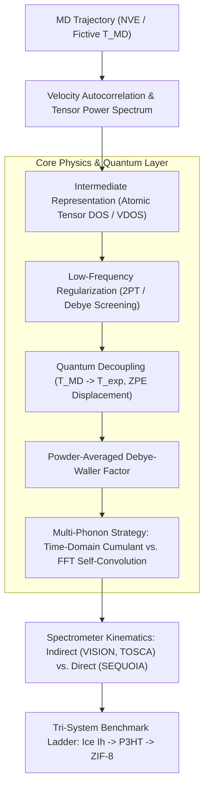

# Complete Chat & Research Session Transcript

**Session Conversation ID:** `26781005-827a-4388-a572-30eeb5528bac`  
**Repository:** `alc-hack-team8-clean`  
**Date:** 2026-09-23 / 2026-09-24  
**Topic:** Inelastic Neutron Scattering (INS) Simulation from Molecular Dynamics Trajectories via Intermediate Phonon DOS (VIR-INS)

---

## User Input (Step 1 | 2026-09-23T21:54:42Z)

<USER_REQUEST>
Fetch the Gemini CLI elephant-goldfish bootstrap procedure with
`gh api repos/vshvedov/elephant-goldfish/contents/gemini/BOOTSTRAP.md -H 'Accept: application/vnd.github.raw'`,
then follow the procedure to set up the Gemini CLI elephant/goldfish workflow here, preserving any existing setups for other AIs.
</USER_REQUEST>
<ADDITIONAL_METADATA>
The current local time is: 2026-09-23T22:54:42+01:00.
</ADDITIONAL_METADATA>
<USER_SETTINGS_CHANGE>
The user changed setting `Model Selection` from None to Gemini 3.8 Flash (High). No need to comment on this change if the user doesn't ask about it. If reporting what model you are, please use a human readable name instead of the exact string.
</USER_SETTINGS_CHANGE>

---

### 💻 Tool Call: `run_command` (Fetch bootstrap procedure)

```bash
gh api repos/vshvedov/elephant-goldfish/contents/gemini/BOOTSTRAP.md -H 'Accept: application/vnd.github.raw'
```

---

### 💻 Tool Call: `run_command` (Fetch bootstrap procedure)

```bash
gh api repos/vshvedov/elephant-goldfish/contents/gemini/BOOTSTRAP.md -H 'Accept: application/vnd.github.raw'
```

---

### 💻 Tool Call: `run_command` (Fetch template files)

```bash
mkdir -p /tmp/elephant-goldfish/gemini/commands
for f in gemini/gemini-md-snippet.md gemini/commands/eg-brainstorm.md gemini/commands/eg-prd.md gemini/commands/eg-fix-bug.md gemini/commands/eg-new-feature.md gemini/commands/eg-precommit-review.md; do
  gh api "repos/vshvedov/elephant-goldfish/contents/${f}" -H 'Accept: application/vnd.github.raw' > "/tmp/elephant-goldfish/${f}"
done
ls -la /tmp/elephant-goldfish/gemini /tmp/elephant-goldfish/gemini/commands

```

---

### 💻 Tool Call: `run_command` (List directory contents)

```bash
ls -la
```

---

### 💻 Tool Call: `run_command` (List directory contents)

```bash
ls -la
```

---

### 💻 Tool Call: `run_command` (Check git status)

```bash
git status
```

---

### 💻 Tool Call: `run_command` (List parent directory)

```bash
ls -la ..
```

---

### 💻 Tool Call: `run_command` (Check sibling directory)

```bash
ls -la ../alc-hack-team8
```

---

### 💻 Tool Call: `run_command` (Check other directory)

```bash
ls -la ../alc-hack-team8/.agents ../alc-hack-team8/.gemini
git -C ../alc-hack-team8 status
git -C ../alc-hack-team8 log -n 5 --oneline

```

---

### Tool Call: `view_file`

---

### Tool Call: `view_file`

---

### Tool Call: `view_file`

---

### Tool Call: `view_file`

---

### Tool Call: `view_file`

---

### Tool Call: `view_file`

---

### 💻 Tool Call: `run_command` (Check gemini command)

```bash
which gemini || true
gemini --version || true

```

---

### 💻 Tool Call: `run_command` (Check gemini skills help)

```bash
gemini skills --help || true
```

---

### 💻 Tool Call: `run_command` (List installed skills)

```bash
gemini skills list
```

---

### 💻 Tool Call: `run_command` (Check python environment)

```bash
/opt/micromamba/envs/janus/bin/python --version || which python || true
which uv || true

```

---

### 💻 Tool Call: `run_command` (Check installed python tools)

```bash
/opt/micromamba/envs/janus/bin/pytest --version || true
/opt/micromamba/envs/janus/bin/ruff --version || true
/opt/micromamba/envs/janus/bin/mypy --version || true
/opt/micromamba/envs/janus/bin/janus --version || true

```

---

### 💻 Tool Call: `run_command` (Test uv run with janus python)

```bash
uv run --no-project --python /opt/micromamba/envs/janus/bin/python -m ruff --version
uv run --no-project --python /opt/micromamba/envs/janus/bin/python -m pytest --version

```

---

### 💻 Tool Call: `run_command` (Check gemini skills install help)

```bash
gemini skills install --help
```

---

### 📝 Tool Call: `write_to_file`

- **Target File:** `/home/drFaustroll/.gemini/antigravity/brain/26781005-827a-4388-a572-30eeb5528bac/implementation_plan.md`
- **Description:** Create implementation plan for elephant-goldfish bootstrap in alc-hack-team8-clean

---

## Assistant Response (Step 48 | 2026-09-23T21:58:20Z)

I have fetched the Gemini CLI elephant-goldfish bootstrap procedure and created an implementation plan according to **Step 0** and **Step 1** of `BOOTSTRAP.md`.

Please review the plan in [implementation_plan.md](file:///home/drFaustroll/.gemini/antigravity/brain/26781005-827a-4388-a572-30eeb5528bac/implementation_plan.md) and confirm or provide feedback so we can proceed with generating and installing the skills.

## User Input (Step 49 | 2026-09-23T21:58:38Z)

Comments on artifact URI: file:///home/drFaustroll/.gemini/antigravity/brain/26781005-827a-4388-a572-30eeb5528bac/implementation_plan.md

The user has approved this document.


<USER_REQUEST>

</USER_REQUEST>
<ADDITIONAL_METADATA>
The current local time is: 2026-09-23T22:58:38+01:00.
</ADDITIONAL_METADATA>

---

### 💻 Tool Call: `run_command` (Initialize git repo)

```bash
git init
```

---

### 💻 Tool Call: `run_command` (Set default branch)

```bash
git branch -M main
```

---

### 💻 Tool Call: `run_command` (Check eg-brainstorm placeholders)

```bash
grep -n "BOOTSTRAP" /tmp/elephant-goldfish/gemini/commands/eg-brainstorm.md || true
```

---

### 💻 Tool Call: `run_command` (Check eg-prd placeholders)

```bash
grep -n "BOOTSTRAP" /tmp/elephant-goldfish/gemini/commands/eg-prd.md || true
```

---

### 💻 Tool Call: `run_command` (Check eg-fix-bug placeholders)

```bash
grep -n "BOOTSTRAP" /tmp/elephant-goldfish/gemini/commands/eg-fix-bug.md || true
```

---

### Tool Call: `view_file`

---

### 💻 Tool Call: `run_command` (Check eg-new-feature placeholders)

```bash
grep -n "BOOTSTRAP" /tmp/elephant-goldfish/gemini/commands/eg-new-feature.md || true
```

---

### Tool Call: `view_file`

---

### Tool Call: `view_file`

---

### 💻 Tool Call: `run_command` (Check eg-precommit-review placeholders)

```bash
grep -n "BOOTSTRAP" /tmp/elephant-goldfish/gemini/commands/eg-precommit-review.md || true
```

---

### Tool Call: `view_file`

---

### 💻 Tool Call: `run_command` (Create skill directories)

```bash
mkdir -p .gemini/skills/eg-brainstorm .gemini/skills/eg-prd .gemini/skills/eg-fix-bug .gemini/skills/eg-new-feature .gemini/skills/eg-precommit-review docs/eg-brainstorms docs/prds docs/design tests
```

---

### 💻 Tool Call: `run_command` (Generate eg-brainstorm skill)

```bash
sed 's|\[BOOTSTRAP: docs path or inferred working-notes location, e.g. `docs/eg-brainstorms/<slug>-<YYYY-MM-DD>.md` or `notes/`\]|docs/eg-brainstorms/<slug>-<YYYY-MM-DD>.md|g' \
  /tmp/elephant-goldfish/gemini/commands/eg-brainstorm.md > .gemini/skills/eg-brainstorm/SKILL.md
grep -n "BOOTSTRAP" .gemini/skills/eg-brainstorm/SKILL.md || echo "eg-brainstorm clean"

```

---

### 💻 Tool Call: `run_command` (Generate eg-prd skill)

```bash
sed -e 's|\[BOOTSTRAP: prd path, e.g. `docs/prds/<slug>-<YYYY-MM-DD>.md` or `docs/specs/`\]|docs/prds/<slug>-<YYYY-MM-DD>.md|g' \
    -e 's|\[BOOTSTRAP: commit-policy reminder per project.\]|Follow Conventional Commits (e.g. feat:, fix:, docs:, test:).|g' \
  /tmp/elephant-goldfish/gemini/commands/eg-prd.md > .gemini/skills/eg-prd/SKILL.md
grep -n "BOOTSTRAP" .gemini/skills/eg-prd/SKILL.md || echo "eg-prd clean"

```

---

### 💻 Tool Call: `run_command` (Generate eg-fix-bug skill)

```bash
/opt/micromamba/envs/janus/bin/python -c '
with open("/tmp/elephant-goldfish/gemini/commands/eg-fix-bug.md") as f:
    content = f.read()

browser_block = """[BOOTSTRAP: browser validation block — pick one and substitute:
- For web apps: "For UI bugs, the repro path usually involves navigating the web app at `[BOOTSTRAP: dev URL]`. Assume the dev server is running, or start it via `[BOOTSTRAP: dev start command]`."
- For mobile: "For UI bugs, the verification path is a simulator/device run (`flutter run -d <device>` or equivalent)."
- For backend-only services: "Repro is usually a `curl` against the local server, a failing test name, or a log line."]"""

browser_replacement = "For headless atomistic calculations and scripts: Repro is usually running a script (`uv run --no-project --python /opt/micromamba/envs/janus/bin/python <script.py>`), a failing pytest test, or an atomistic calculation error log."

content = content.replace(browser_block, browser_replacement)
content = content.replace("[BOOTSTRAP: one-sentence project description]", "alc-hack-team8 atomistic simulation and MLIP workflow repository")

test_tier_pick = """[BOOTSTRAP: test tier picks — replace with concrete options for this stack.]"""
test_tier_replacement = """- **Unit test (`tests/test_*.py`)**: Use `uv run --no-project --python /opt/micromamba/envs/janus/bin/python -m pytest tests/test_<module>.py -k <test_name>` to verify specific functions or calculators.
- **Integration / simulation test**: Run a small single-point calculation or short relaxation with a small MLIP model (e.g. MACE, CHGNet) using `--no-tracker`."""
content = content.replace(test_tier_pick, test_tier_replacement)

ui_fallback = "[BOOTSTRAP: UI bug repro fallback — pick one.]"
ui_fallback_replacement = "For simulation and calculation bugs, verify outputs against reference structures, energies, or trajectory logs."
content = content.replace(ui_fallback, ui_fallback_replacement)

test_gate = """[BOOTSTRAP: test gate commands as separate lines, e.g.:
- `npm test`
- `npm run test:e2e`
]"""
test_gate_replacement = """uv run --no-project --python /opt/micromamba/envs/janus/bin/python -m ruff check .
uv run --no-project --python /opt/micromamba/envs/janus/bin/python -m pytest"""
content = content.replace(test_gate, test_gate_replacement)

content = content.replace("[BOOTSTRAP: commit-policy reminder per project.]", "Follow Conventional Commits (`feat:`, `fix:`, `docs:`, `test:`, `refactor:`).")

with open(".gemini/skills/eg-fix-bug/SKILL.md", "w") as f:
    f.write(content)
'
grep -n "BOOTSTRAP" .gemini/skills/eg-fix-bug/SKILL.md || echo "eg-fix-bug clean"

```

---

### Tool Call: `view_file`

---

### Tool Call: `view_file`

---

### Tool Call: `view_file`

---

### 💻 Tool Call: `run_command` (Generate eg-new-feature skill)

```bash
/opt/micromamba/envs/janus/bin/python -c '
with open("/tmp/elephant-goldfish/gemini/commands/eg-new-feature.md") as f:
    content = f.read()

substitutions = [
    ("[BOOTSTRAP: project-specific routing note]", "For atomistic simulation workflows (singlepoint, geomopt, md, neb, phonons, eos), ground configurations in STFC janus-core standards and verify coordinates/PBCs."),
    ("[BOOTSTRAP: project-priority sanity-check block]", "Ensure alignment with scientific modeling goals (e.g. reproducing Cheng 2020 / Harrelson 2021 findings, trajectory analysis, or MLIP evaluation)."),
    ("[BOOTSTRAP: surface-area sanity-check]", "Check required dependencies in the janus environment, calculation parameters, and trajectory output storage."),
    ("[BOOTSTRAP: docs path]", "docs/design/<feature-name>-design.md"),
    ("[BOOTSTRAP: stack-specific design-doc fields]", "- Simulation parameters: <MLIP calculator (e.g. MACE, SevenNet, CHGNet), ensemble (NVE/NVT/NPT), timestep, filter_func (FrechetCellFilter), emission tracking (--no-tracker)>\n- Scientific observables: <energies, forces, stress, MSD, RDF, VAF, phonons>"),
    ("[BOOTSTRAP: PRD reference note]", "If an eg-prd exists for this feature in docs/prds/, verify the design doc satisfies all functional requirements and non-functional constraints."),
    ("[BOOTSTRAP: project name + one-sentence description]", "alc-hack-team8 atomistic simulation and MLIP workflow repository"),
    ("[BOOTSTRAP: stack-specific gap items]", "- Are atomistic structures and periodic boundary conditions correctly validated?\n- Is FrechetCellFilter specified for crystal cell optimizations?\n- Is --no-tracker passed for automated scripts and headless runs?\n- Does the execution use uv with the janus environment (/opt/micromamba/envs/janus/bin/python)?"),
    ("[BOOTSTRAP: PRD note]", "If this design doc implements a PRD, check that all PRD requirements and constraints are addressed."),
    ("[BOOTSTRAP: implementation layer ordering for this stack.]", "1. Data/Structure inputs: structure parsing, XYZ/cif validation, PBC checks.\n2. Core logic / simulation runner: calculator setup, janus-core CLI/Python wrapper, filter configuration.\n3. Analysis / post-processing: RDF, MSD, observable extraction.\n4. Tests: unit tests with pytest, small integration tests."),
    ("[BOOTSTRAP: per-layer verification examples for this stack.]", "- Structure layer: verify coordinates and cell with structure inspector or ASE read.\n- Simulation layer: run 1-step test with `--no-tracker` using `uv run --no-project --python /opt/micromamba/envs/janus/bin/python`.\n- Analysis layer: assert expected shape and values on test trajectory."),
    ("[BOOTSTRAP: UI driving rule]", "Not applicable for headless simulation scripts."),
    ("[BOOTSTRAP: cross-tenant or other always-verify reminder]", "Always verify that simulations specify `--no-tracker` and use `FrechetCellFilter` when cell relaxation is involved."),
    ("""[BOOTSTRAP: test gate commands per stack]""", """uv run --no-project --python /opt/micromamba/envs/janus/bin/python -m ruff check .
uv run --no-project --python /opt/micromamba/envs/janus/bin/python -m pytest"""),
    ("[BOOTSTRAP: commit-policy reminder per project.]", "Follow Conventional Commits (`feat:`, `fix:`, `docs:`, `test:`, `refactor:`).")
]

for target, repl in substitutions:
    content = content.replace(target, repl)

with open(".gemini/skills/eg-new-feature/SKILL.md", "w") as f:
    f.write(content)
'
grep -n "BOOTSTRAP" .gemini/skills/eg-new-feature/SKILL.md || echo "eg-new-feature clean"

```

---

### Tool Call: `view_file`

---

### Tool Call: `view_file`

---

### 💻 Tool Call: `run_command` (Generate eg-precommit-review skill)

```bash
/opt/micromamba/envs/janus/bin/python -c '
with open("/tmp/elephant-goldfish/gemini/commands/eg-precommit-review.md") as f:
    content = f.read()

preflight_old = """Execute these using `run_shell_command`:

```sh
[BOOTSTRAP: lint command]
```
- New errors introduced by the diff are blockers.

[BOOTSTRAP: typecheck block]
```sh
[BOOTSTRAP: typecheck command]
```

```sh
[BOOTSTRAP: unit test command]
```
- If a test fails because your implementation legitimately changed its expected behavior, do NOT rewrite the test silently.

[BOOTSTRAP: e2e test block]
```sh
[BOOTSTRAP: e2e test command]
```

[BOOTSTRAP: code-generation block]
```sh
[BOOTSTRAP: codegen command]
```"""

preflight_new = """Execute these using `run_shell_command`:

```sh
uv run --no-project --python /opt/micromamba/envs/janus/bin/python -m ruff check .
```
- New errors introduced by the diff are blockers.

```sh
uv run --no-project --python /opt/micromamba/envs/janus/bin/python -m pytest
```
- If a test fails because your implementation legitimately changed its expected behavior, do NOT rewrite the test silently."""

content = content.replace(preflight_old, preflight_new)

hunt_for = """[BOOTSTRAP: stack-specific Hunt for items go here as additional bullets]"""
hunt_for_new = """- Janus-Core rules: missing `--no-tracker` in automated scripts, missing `FrechetCellFilter` (or `filter_func="FrechetCellFilter"`) on crystal cell optimizations.
- Python environment: commands executing outside `/opt/micromamba/envs/janus/bin/python` or without `uv run`.
- Structure validation: coordinates or periodic boundary conditions (PBCs) not validated before heavy simulation runs."""
content = content.replace(hunt_for, hunt_for_new)

content = content.replace("[BOOTSTRAP: commit policy reminder]", "Follow Conventional Commits (`feat:`, `fix:`, `docs:`, `test:`, `refactor:`).")

with open(".gemini/skills/eg-precommit-review/SKILL.md", "w") as f:
    f.write(content)
'
grep -n "BOOTSTRAP" .gemini/skills/eg-precommit-review/SKILL.md || echo "eg-precommit-review clean"

```

---

### 💻 Tool Call: `run_command` (Check snippet placeholders)

```bash
grep -n "BOOTSTRAP" /tmp/elephant-goldfish/gemini/gemini-md-snippet.md || true
```

---

### 📝 Tool Call: `write_to_file`

- **Target File:** `/home/drFaustroll/playground/ml/alc-hack-team8-clean/GEMINI.md`
- **Description:** Create GEMINI.md with Elephant/Goldfish workflow documentation and project guidelines

---

### 💻 Tool Call: `run_command` (Install skills in workspace)

```bash
for s in eg-brainstorm eg-prd eg-fix-bug eg-new-feature eg-precommit-review; do
  echo "Installing $s..."
  gemini skills install ".gemini/skills/$s" --scope workspace --consent
done
gemini skills list

```

---

### 💻 Tool Call: `run_command` (Check skills directory)

```bash
ls -la .gemini/skills
```

---

### 💻 Tool Call: `run_command` (Create staging directory)

```bash
mkdir -p /tmp/elephant-goldfish/ready/eg-brainstorm \
         /tmp/elephant-goldfish/ready/eg-prd \
         /tmp/elephant-goldfish/ready/eg-fix-bug \
         /tmp/elephant-goldfish/ready/eg-new-feature \
         /tmp/elephant-goldfish/ready/eg-precommit-review

```

---

### 💻 Tool Call: `run_command` (Prepare staged skills)

```bash
/opt/micromamba/envs/janus/bin/python -c '
import os

# 1. eg-brainstorm
with open("/tmp/elephant-goldfish/gemini/commands/eg-brainstorm.md") as f:
    c = f.read()
c = c.replace("[BOOTSTRAP: docs path or inferred working-notes location, e.g. `docs/eg-brainstorms/<slug>-<YYYY-MM-DD>.md` or `notes/`]", "docs/eg-brainstorms/<slug>-<YYYY-MM-DD>.md")
with open("/tmp/elephant-goldfish/ready/eg-brainstorm/SKILL.md", "w") as f:
    f.write(c)

# 2. eg-prd
with open("/tmp/elephant-goldfish/gemini/commands/eg-prd.md") as f:
    c = f.read()
c = c.replace("[BOOTSTRAP: prd path, e.g. `docs/prds/<slug>-<YYYY-MM-DD>.md` or `docs/specs/`]", "docs/prds/<slug>-<YYYY-MM-DD>.md")
c = c.replace("[BOOTSTRAP: commit-policy reminder per project.]", "Follow Conventional Commits (e.g. feat:, fix:, docs:, test:).")
with open("/tmp/elephant-goldfish/ready/eg-prd/SKILL.md", "w") as f:
    f.write(c)

# 3. eg-fix-bug
with open("/tmp/elephant-goldfish/gemini/commands/eg-fix-bug.md") as f:
    c = f.read()

browser_block = """[BOOTSTRAP: browser validation block — pick one and substitute:
- For web apps: "For UI bugs, the repro path usually involves navigating the web app at `[BOOTSTRAP: dev URL]`. Assume the dev server is running, or start it via `[BOOTSTRAP: dev start command]`."
- For mobile: "For UI bugs, the verification path is a simulator/device run (`flutter run -d <device>` or equivalent)."
- For backend-only services: "Repro is usually a `curl` against the local server, a failing test name, or a log line."]"""
browser_repl = "For headless atomistic calculations and scripts: Repro is usually running a script (`uv run --no-project --python /opt/micromamba/envs/janus/bin/python <script.py>`), a failing pytest test, or an atomistic calculation error log."
c = c.replace(browser_block, browser_repl)
c = c.replace("[BOOTSTRAP: one-sentence project description]", "alc-hack-team8 atomistic simulation and MLIP workflow repository")

test_tier_pick = """[BOOTSTRAP: test tier picks — replace with concrete options for this stack.]"""
test_tier_repl = """- **Unit test (`tests/test_*.py`)**: Use `uv run --no-project --python /opt/micromamba/envs/janus/bin/python -m pytest tests/test_<module>.py -k <test_name>` to verify specific functions or calculators.
- **Integration / simulation test**: Run a small single-point calculation or short relaxation with a small MLIP model (e.g. MACE, CHGNet) using `--no-tracker`."""
c = c.replace(test_tier_pick, test_tier_repl)

c = c.replace("[BOOTSTRAP: UI bug repro fallback — pick one.]", "For simulation and calculation bugs, verify outputs against reference structures, energies, or trajectory logs.")

test_gate = """[BOOTSTRAP: test gate commands as separate lines, e.g.:
- `npm test`
- `npm run test:e2e`
]"""
test_gate_repl = """uv run --no-project --python /opt/micromamba/envs/janus/bin/python -m ruff check .
uv run --no-project --python /opt/micromamba/envs/janus/bin/python -m pytest"""
c = c.replace(test_gate, test_gate_repl)
c = c.replace("[BOOTSTRAP: commit-policy reminder per project.]", "Follow Conventional Commits (`feat:`, `fix:`, `docs:`, `test:`, `refactor:`).")
with open("/tmp/elephant-goldfish/ready/eg-fix-bug/SKILL.md", "w") as f:
    f.write(c)

# 4. eg-new-feature
with open("/tmp/elephant-goldfish/gemini/commands/eg-new-feature.md") as f:
    c = f.read()

substitutions = [
    ("[BOOTSTRAP: project-specific routing note]", "For atomistic simulation workflows (singlepoint, geomopt, md, neb, phonons, eos), ground configurations in STFC janus-core standards and verify coordinates/PBCs."),
    ("[BOOTSTRAP: project-priority sanity-check block]", "Ensure alignment with scientific modeling goals (e.g. reproducing Cheng 2020 / Harrelson 2021 findings, trajectory analysis, or MLIP evaluation)."),
    ("[BOOTSTRAP: surface-area sanity-check]", "Check required dependencies in the janus environment, calculation parameters, and trajectory output storage."),
    ("[BOOTSTRAP: docs path]", "docs/design/<feature-name>-design.md"),
    ("[BOOTSTRAP: stack-specific design-doc fields]", "- Simulation parameters: <MLIP calculator (e.g. MACE, SevenNet, CHGNet), ensemble (NVE/NVT/NPT), timestep, filter_func (FrechetCellFilter), emission tracking (--no-tracker)>\n- Scientific observables: <energies, forces, stress, MSD, RDF, VAF, phonons>"),
    ("[BOOTSTRAP: PRD reference note]", "If an eg-prd exists for this feature in docs/prds/, verify the design doc satisfies all functional requirements and non-functional constraints."),
    ("[BOOTSTRAP: project name + one-sentence description]", "alc-hack-team8 atomistic simulation and MLIP workflow repository"),
    ("[BOOTSTRAP: stack-specific gap items]", "- Are atomistic structures and periodic boundary conditions correctly validated?\n- Is FrechetCellFilter specified for crystal cell optimizations?\n- Is --no-tracker passed for automated scripts and headless runs?\n- Does the execution use uv with the janus environment (/opt/micromamba/envs/janus/bin/python)?"),
    ("[BOOTSTRAP: PRD note]", "If this design doc implements a PRD, check that all PRD requirements and constraints are addressed."),
    ("[BOOTSTRAP: implementation layer ordering for this stack.]", "1. Data/Structure inputs: structure parsing, XYZ/cif validation, PBC checks.\n2. Core logic / simulation runner: calculator setup, janus-core CLI/Python wrapper, filter configuration.\n3. Analysis / post-processing: RDF, MSD, observable extraction.\n4. Tests: unit tests with pytest, small integration tests."),
    ("[BOOTSTRAP: per-layer verification examples for this stack.]", "- Structure layer: verify coordinates and cell with structure inspector or ASE read.\n- Simulation layer: run 1-step test with `--no-tracker` using `uv run --no-project --python /opt/micromamba/envs/janus/bin/python`.\n- Analysis layer: assert expected shape and values on test trajectory."),
    ("[BOOTSTRAP: UI driving rule]", "Not applicable for headless simulation scripts."),
    ("[BOOTSTRAP: cross-tenant or other always-verify reminder]", "Always verify that simulations specify `--no-tracker` and use `FrechetCellFilter` when cell relaxation is involved."),
    ("""[BOOTSTRAP: test gate commands per stack]""", """uv run --no-project --python /opt/micromamba/envs/janus/bin/python -m ruff check .
uv run --no-project --python /opt/micromamba/envs/janus/bin/python -m pytest"""),
    ("[BOOTSTRAP: commit-policy reminder per project.]", "Follow Conventional Commits (`feat:`, `fix:`, `docs:`, `test:`, `refactor:`).")
]
for target, repl in substitutions:
    c = c.replace(target, repl)
with open("/tmp/elephant-goldfish/ready/eg-new-feature/SKILL.md", "w") as f:
    f.write(c)

# 5. eg-precommit-review
with open("/tmp/elephant-goldfish/gemini/commands/eg-precommit-review.md") as f:
    c = f.read()

preflight_old = """Execute these using `run_shell_command`:

```sh
[BOOTSTRAP: lint command]
```
- New errors introduced by the diff are blockers.

[BOOTSTRAP: typecheck block]
```sh
[BOOTSTRAP: typecheck command]
```

```sh
[BOOTSTRAP: unit test command]
```
- If a test fails because your implementation legitimately changed its expected behavior, do NOT rewrite the test silently.

[BOOTSTRAP: e2e test block]
```sh
[BOOTSTRAP: e2e test command]
```

[BOOTSTRAP: code-generation block]
```sh
[BOOTSTRAP: codegen command]
```"""

preflight_new = """Execute these using `run_shell_command`:

```sh
uv run --no-project --python /opt/micromamba/envs/janus/bin/python -m ruff check .
```
- New errors introduced by the diff are blockers.

```sh
uv run --no-project --python /opt/micromamba/envs/janus/bin/python -m pytest
```
- If a test fails because your implementation legitimately changed its expected behavior, do NOT rewrite the test silently."""

c = c.replace(preflight_old, preflight_new)

hunt_for = """[BOOTSTRAP: stack-specific Hunt for items go here as additional bullets]"""
hunt_for_new = """- Janus-Core rules: missing `--no-tracker` in automated scripts, missing `FrechetCellFilter` (or `filter_func="FrechetCellFilter"`) on crystal cell optimizations.
- Python environment: commands executing outside `/opt/micromamba/envs/janus/bin/python` or without `uv run`.
- Structure validation: coordinates or periodic boundary conditions (PBCs) not validated before heavy simulation runs."""
c = c.replace(hunt_for, hunt_for_new)
c = c.replace("[BOOTSTRAP: commit policy reminder]", "Follow Conventional Commits (`feat:`, `fix:`, `docs:`, `test:`, `refactor:`).")
with open("/tmp/elephant-goldfish/ready/eg-precommit-review/SKILL.md", "w") as f:
    f.write(c)
'
grep -rn "BOOTSTRAP" /tmp/elephant-goldfish/ready/ || echo "All staged templates clean"

```

---

## User Input (Step 106 | 2026-09-23T22:07:33Z)

<USER_REQUEST>
ignore all the global skills and rules from others repos and so on... concentrate only on this folder and repo
</USER_REQUEST>
<ADDITIONAL_METADATA>
The current local time is: 2026-09-23T23:07:33+01:00.
</ADDITIONAL_METADATA>

---

### 💻 Tool Call: `run_command` (Check directory status)

```bash
ls -la
ls -la .gemini || true

```

---

### 💻 Tool Call: `run_command` (Check git status and papers)

```bash
ls -la papers
git status

```

---

### 💻 Tool Call: `run_command` (Check system python tools)

```bash
python3 --version
which pytest || true
which ruff || true
which uv || true

```

---

### 💻 Tool Call: `run_command` (Test skill discovery)

```bash
mkdir -p .gemini/skills/test-skill
cat << 'EOF' > .gemini/skills/test-skill/SKILL.md
---
name: test-skill
description: A test skill to verify discovery
---
Test skill instructions.
EOF
gemini skills list

```

---

### 💻 Tool Call: `run_command` (Remove test skill)

```bash
rm -rf .gemini/skills/test-skill
```

---

### 💻 Tool Call: `run_command` (Generate skills)

```bash
python3 - << 'EOF'
import os

os.makedirs(".gemini/skills/eg-brainstorm", exist_ok=True)
os.makedirs(".gemini/skills/eg-prd", exist_ok=True)
os.makedirs(".gemini/skills/eg-fix-bug", exist_ok=True)
os.makedirs(".gemini/skills/eg-new-feature", exist_ok=True)
os.makedirs(".gemini/skills/eg-precommit-review", exist_ok=True)
os.makedirs("docs/eg-brainstorms", exist_ok=True)
os.makedirs("docs/prds", exist_ok=True)
os.makedirs("docs/design", exist_ok=True)

# 1. eg-brainstorm
with open("/tmp/elephant-goldfish/gemini/commands/eg-brainstorm.md") as f:
    c = f.read()
c = c.replace("[BOOTSTRAP: docs path or inferred working-notes location, e.g. `docs/eg-brainstorms/<slug>-<YYYY-MM-DD>.md` or `notes/`]", "docs/eg-brainstorms/<slug>-<YYYY-MM-DD>.md")
with open(".gemini/skills/eg-brainstorm/SKILL.md", "w") as f:
    f.write(c)

# 2. eg-prd
with open("/tmp/elephant-goldfish/gemini/commands/eg-prd.md") as f:
    c = f.read()
c = c.replace("[BOOTSTRAP: prd path, e.g. `docs/prds/<slug>-<YYYY-MM-DD>.md` or `docs/specs/`]", "docs/prds/<slug>-<YYYY-MM-DD>.md")
c = c.replace("[BOOTSTRAP: commit-policy reminder per project.]", "Follow Conventional Commits (e.g. feat:, fix:, docs:, test:).")
with open(".gemini/skills/eg-prd/SKILL.md", "w") as f:
    f.write(c)

# 3. eg-fix-bug
with open("/tmp/elephant-goldfish/gemini/commands/eg-fix-bug.md") as f:
    c = f.read()
browser_block = """[BOOTSTRAP: browser validation block — pick one and substitute:
- For web apps: "For UI bugs, the repro path usually involves navigating the web app at `[BOOTSTRAP: dev URL]`. Assume the dev server is running, or start it via `[BOOTSTRAP: dev start command]`."
- For mobile: "For UI bugs, the verification path is a simulator/device run (`flutter run -d <device>` or equivalent)."
- For backend-only services: "Repro is usually a `curl` against the local server, a failing test name, or a log line."]"""
browser_repl = "Repro is usually executing a script, a failing pytest test, or an error log."
c = c.replace(browser_block, browser_repl)
c = c.replace("[BOOTSTRAP: one-sentence project description]", "alc-hack-team8 research and modeling repository")

test_tier_pick = """[BOOTSTRAP: test tier picks — replace with concrete options for this stack.]"""
test_tier_repl = """- **Unit test (`tests/test_*.py`)**: Use `pytest tests/test_<module>.py -k <test_name>` to verify specific functions or modules.
- **Integration test**: Run end-to-end script or workflow on a minimal test dataset or sample input."""
c = c.replace(test_tier_pick, test_tier_repl)

ui_fallback = "[BOOTSTRAP: UI bug repro fallback — pick one.]"
ui_fallback_repl = "For computational or data processing bugs, verify outputs against reference calculations or expected outputs."
c = c.replace(ui_fallback, ui_fallback_repl)

test_gate = """[BOOTSTRAP: test gate commands as separate lines, e.g.:
- `npm test`
- `npm run test:e2e`
]"""
test_gate_repl = """ruff check .
pytest"""
c = c.replace(test_gate, test_gate_repl)
c = c.replace("[BOOTSTRAP: commit-policy reminder per project.]", "Follow Conventional Commits (`feat:`, `fix:`, `docs:`, `test:`, `refactor:`).")
with open(".gemini/skills/eg-fix-bug/SKILL.md", "w") as f:
    f.write(c)

# 4. eg-new-feature
with open("/tmp/elephant-goldfish/gemini/commands/eg-new-feature.md") as f:
    c = f.read()

substitutions = [
    ("[BOOTSTRAP: project-specific routing note]", "Ground feature designs in the project objectives, existing scripts, and relevant literature in papers/."),
    ("[BOOTSTRAP: project-priority sanity-check block]", "Ensure alignment with research and modeling goals (e.g. methods and findings from literature in papers/)."),
    ("[BOOTSTRAP: surface-area sanity-check]", "Check required dependencies, data inputs, and compute requirements."),
    ("[BOOTSTRAP: docs path]", "docs/design/<feature-name>-design.md"),
    ("[BOOTSTRAP: stack-specific design-doc fields]", "- Algorithm / Model: <methodology, baseline comparisons, mathematical formulation>\n- Data inputs & outputs: <input formats, schemas, generated datasets or figures>"),
    ("[BOOTSTRAP: PRD reference note]", "If an eg-prd exists for this feature in docs/prds/, verify the design doc satisfies all functional requirements and non-functional constraints."),
    ("[BOOTSTRAP: project name + one-sentence description]", "alc-hack-team8 research and modeling repository"),
    ("[BOOTSTRAP: stack-specific gap items]", "- Are mathematical formulations, assumptions, and edge cases clearly specified?\n- Are data inputs, paths, and output formats documented and verified?\n- Are error handling and resource constraints addressed?"),
    ("[BOOTSTRAP: PRD note]", "If this design doc implements a PRD, check that all PRD requirements and constraints are addressed."),
    ("[BOOTSTRAP: implementation layer ordering for this stack.]", "1. Data layer: ingestion, parsing, schema validation.\n2. Core processing / algorithm: logic implementation.\n3. Interfaces / CLI / pipeline: runner scripts.\n4. Tests: unit tests with pytest, integration tests."),
    ("[BOOTSTRAP: per-layer verification examples for this stack.]", "- Data layer: verify with sample data input.\n- Algorithm layer: verify with small unit test or known analytical result.\n- Pipeline layer: run test execution on sample data."),
    ("[BOOTSTRAP: UI driving rule]", "Not applicable for non-UI compute workflows."),
    ("[BOOTSTRAP: cross-tenant or other always-verify reminder]", "Verify reproducibility, deterministic seeds where applicable, and clean separation of test artifacts."),
    ("""[BOOTSTRAP: test gate commands per stack]""", """ruff check .
pytest"""),
    ("[BOOTSTRAP: commit-policy reminder per project.]", "Follow Conventional Commits (`feat:`, `fix:`, `docs:`, `test:`, `refactor:`).")
]
for target, repl in substitutions:
    c = c.replace(target, repl)
with open(".gemini/skills/eg-new-feature/SKILL.md", "w") as f:
    f.write(c)

# 5. eg-precommit-review
with open("/tmp/elephant-goldfish/gemini/commands/eg-precommit-review.md") as f:
    c = f.read()

preflight_old = """Execute these using `run_shell_command`:

```sh
[BOOTSTRAP: lint command]
```
- New errors introduced by the diff are blockers.

[BOOTSTRAP: typecheck block]
```sh
[BOOTSTRAP: typecheck command]
```

```sh
[BOOTSTRAP: unit test command]
```
- If a test fails because your implementation legitimately changed its expected behavior, do NOT rewrite the test silently.

[BOOTSTRAP: e2e test block]
```sh
[BOOTSTRAP: e2e test command]
```

[BOOTSTRAP: code-generation block]
```sh
[BOOTSTRAP: codegen command]
```"""

preflight_new = """Execute these using `run_shell_command`:

```sh
ruff check .
```
- New errors introduced by the diff are blockers.

```sh
pytest
```
- If a test fails because your implementation legitimately changed its expected behavior, do NOT rewrite the test silently."""

c = c.replace(preflight_old, preflight_new)

hunt_for = """[BOOTSTRAP: stack-specific Hunt for items go here as additional bullets]"""
hunt_for_new = """- Numerical stability: division by zero, overflow/underflow, NaN propagation.
- Data integrity: unhandled missing values, shape mismatches, unvalidated file inputs.
- Resource management: unclosed file handles, memory leaks during batch processing."""
c = c.replace(hunt_for, hunt_for_new)
c = c.replace("[BOOTSTRAP: commit policy reminder]", "Follow Conventional Commits (`feat:`, `fix:`, `docs:`, `test:`, `refactor:`).")
with open(".gemini/skills/eg-precommit-review/SKILL.md", "w") as f:
    f.write(c)

print("Skills created successfully.")
EOF

```

---

### 💻 Tool Call: `run_command` (Check skill placeholders)

```bash
grep -rn "BOOTSTRAP" .gemini/skills/ || echo "No placeholders remaining in skills!"
```

---

### 💻 Tool Call: `run_command` (List discovered skills)

```bash
gemini skills list
```

---

### 📝 Tool Call: `write_to_file`

- **Target File:** `/home/drFaustroll/playground/ml/alc-hack-team8-clean/GEMINI.md`
- **Description:** Write GEMINI.md tailored specifically for alc-hack-team8-clean with Elephant/Goldfish workflow

---

### 💻 Tool Call: `run_command` (Run sanity checks)

```bash
python3 - << 'EOF'
import os, glob

skills = glob.glob(".gemini/skills/*/SKILL.md")
print(f"Checking {len(skills)} skills...")

for s in sorted(skills):
    with open(s) as f:
        content = f.read()
    
    # Check frontmatter
    assert content.startswith("---\nname: "), f"Missing frontmatter in {s}"
    assert "\ndescription: " in content[:150], f"Missing description in {s}"
    assert "\n---\n" in content[:300], f"Frontmatter closing missing in {s}"
    
    # Check no BOOTSTRAP markers
    assert "[BOOTSTRAP:" not in content, f"Unsubstituted BOOTSTRAP marker in {s}"
    print(f"✓ {s}: Frontmatter intact, 0 BOOTSTRAP markers.")

# Check markers in eg-precommit-review
with open(".gemini/skills/eg-precommit-review/SKILL.md") as f:
    c = f.read()
assert "<<<TEMPLATE_START>>>" in c, "Missing <<<TEMPLATE_START>>> in eg-precommit-review"
assert "<<<TEMPLATE_END>>>" in c, "Missing <<<TEMPLATE_END>>> in eg-precommit-review"
print("✓ eg-precommit-review template markers intact.")

# Check markers in eg-new-feature
with open(".gemini/skills/eg-new-feature/SKILL.md") as f:
    c = f.read()
assert "<<<COMPREHENSION_START>>>" in c and "<<<COMPREHENSION_END>>>" in c
assert "<<<DESIGN_START>>>" in c and "<<<DESIGN_END>>>" in c
assert "<<<READINESS_START>>>" in c and "<<<READINESS_END>>>" in c
print("✓ eg-new-feature comprehension/design/readiness markers intact.")

# Check GEMINI.md
with open("GEMINI.md") as f:
    gemini_md = f.read()
assert "[BOOTSTRAP:" not in gemini_md, "Unsubstituted BOOTSTRAP marker in GEMINI.md"
print("✓ GEMINI.md intact with 0 BOOTSTRAP markers.")
EOF

```

---

### 💻 Tool Call: `run_command` (Check git status)

```bash
git status
```

---

### 📝 Tool Call: `write_to_file`

- **Target File:** `/home/drFaustroll/.gemini/antigravity/brain/26781005-827a-4388-a572-30eeb5528bac/walkthrough.md`
- **Description:** Create walkthrough artifact summarizing the elephant-goldfish setup

---

## Assistant Response (Step 132 | 2026-09-23T22:09:53Z)

### Bootstrap Summary & Final Report

The Gemini CLI **Elephant/Goldfish** workflow has been bootstrapped and installed for this repository (`/home/drFaustroll/playground/ml/alc-hack-team8-clean`), concentrating strictly on this folder and repo while preserving any existing setups for other tools.

---

### 1. Stack Profile (Applied)

- **Target Path:** `/home/drFaustroll/playground/ml/alc-hack-team8-clean`
- **Language / Runtime:** Python 3 (`/usr/bin/python3`)
- **Linter:** `ruff check .`
- **Unit/Integration Test Runner:** `pytest`
- **Documentation Trees:** `docs/eg-brainstorms/`, `docs/prds/`, `docs/design/`
- **Research References:** `papers/` (`Cheng2020.pdf`, `harrelson2021.pdf`, `harrelson2021_SI.pdf`)
- **Commit Convention:** Conventional Commits (`feat:`, `fix:`, `docs:`, `test:`, `refactor:`)

---

### 2. Skill Packages Created & Enabled

All five skill packages were created in `.gemini/skills/` with all template markers resolved, frontmatter intact, and delimiting markers preserved:

| Skill | Path | Status | Purpose |
|---|---|---|---|
| `eg-brainstorm` | [`.gemini/skills/eg-brainstorm/SKILL.md`](file:///home/drFaustroll/playground/ml/alc-hack-team8-clean/.gemini/skills/eg-brainstorm/SKILL.md) | `[Enabled]` | Inverted brainstorming flow with parallel divergent goldfish |
| `eg-prd` | [`.gemini/skills/eg-prd/SKILL.md`](file:///home/drFaustroll/playground/ml/alc-hack-team8-clean/.gemini/skills/eg-prd/SKILL.md) | `[Enabled]` | Grounded PRD generation with codebase research |
| `eg-fix-bug` | [`.gemini/skills/eg-fix-bug/SKILL.md`](file:///home/drFaustroll/playground/ml/alc-hack-team8-clean/.gemini/skills/eg-fix-bug/SKILL.md) | `[Enabled]` | Problem doc → goldfish diagnosis check → failing test → fix → review |
| `eg-new-feature` | [`.gemini/skills/eg-new-feature/SKILL.md`](file:///home/drFaustroll/playground/ml/alc-hack-team8-clean/.gemini/skills/eg-new-feature/SKILL.md) | `[Enabled]` | Design doc → three-goldfish check (Comprehension, Critic, Readiness) → implement |
| `eg-precommit-review` | [`.gemini/skills/eg-precommit-review/SKILL.md`](file:///home/drFaustroll/playground/ml/alc-hack-team8-clean/.gemini/skills/eg-precommit-review/SKILL.md) | `[Enabled]` | Independent reviewer loop on pending branch changes |

Verified with `gemini skills list` that all 5 skills are active and existing skills (`quartermaster`) remain unaffected.

---

### 3. Project Configuration

- Created [`GEMINI.md`](file:///home/drFaustroll/playground/ml/alc-hack-team8-clean/GEMINI.md) documenting workflow triggers, examples, and test gate commands.
- Initialized local git branch `main`.

---

> [!IMPORTANT]
> **Activation Step:** If you are running an interactive Gemini CLI session in this directory, run:
> ```sh
> /skills reload
> ```
> to refresh and activate the new workspace skills in your session.

*Note: Per the bootstrap specification, all changes remain staged/uncommitted awaiting your authorization.*

## User Input (Step 133 | 2026-09-23T22:10:15Z)

<USER_REQUEST>
/skills reload
</USER_REQUEST>
<ADDITIONAL_METADATA>
The current local time is: 2026-09-23T23:10:15+01:00.

The user's current state is as follows:
Active Document: /home/drFaustroll/playground/ml/alc-hack-team8-clean/GEMINI.md (LANGUAGE_UNSPECIFIED)
Cursor is on line: 1
</ADDITIONAL_METADATA>

---

### 💻 Tool Call: `run_command` (Check reloaded skills)

```bash
gemini skills list
```

---

## Assistant Response (Step 136 | 2026-09-23T22:10:23Z)

Skills reloaded! All five Elephant/Goldfish skills are discovered, enabled, and ready in your workspace:

- **`eg-brainstorm`** — Early-stage divergent ideation via parallel goldfish
- **`eg-prd`** — Grounded Product Requirements Document builder
- **`eg-fix-bug`** — Bug fix workflow with independent goldfish diagnosis
- **`eg-new-feature`** — Feature development flow with 3-goldfish design check
- **`eg-precommit-review`** — Pre-commit independent code review loop

You can trigger any workflow directly (e.g. `"Let's run eg-brainstorm for..."` or `"Please run eg-new-feature for..."`).

## User Input (Step 137 | 2026-09-23T22:11:55Z)

<USER_REQUEST>
eg-brainstorm create a proposal In this project we intend to implement some methods which are described (without great detail) in scientific papers. They simulate inelastic neutron scattering (INS) measurements using molecular dynamics simulation data; rather than working directly from the trajectory data these methods use derivedphonon density-of-states (and similar) data as an intermediate representation of the system dynamics. the papers pdfs are in folder papers in this repository

</USER_REQUEST>
<ADDITIONAL_METADATA>
The current local time is: 2026-09-23T23:11:55+01:00.

The user's current state is as follows:
Active Document: /home/drFaustroll/playground/ml/alc-hack-team8-clean/GEMINI.md (LANGUAGE_UNSPECIFIED)
Cursor is on line: 1
</ADDITIONAL_METADATA>

---

### ❓ Tool Call: `ask_question`

**Question:** What stage is this proposal / method implementation at?

- (Recommended) Hypothesis to validate — I have a candidate direction (INS simulation via intermediate phonon DOS from MD). Stress-test it and surface adjacent options I'm missing.
- Raw concept — I have a vague thought. Cast a wide net, prioritize divergent ideas over depth.
- Picking between options — I have 2-3 directions in mind. Compare, find a fourth, recommend.
- Feature ideation for existing product — The product exists. I'm sourcing ideas for what to build next.

**Question:** How many concepts should the goldfish surface, total?

- (Recommended) ~10 concepts, balanced — Default. Mix of depth and breadth across methodological and architectural choices.
- ~5 concepts, deeper — Fewer ideas, each more developed. Good for focused proposal formulation.
- ~20 concepts, shallow — Maximum divergence. Broad exploration of potential angles and approaches.

**Question:** Should the goldfish search the web for prior art, scientific packages, and literature?

- (Recommended) On, focused — Search for prior art, existing tools (e.g. OCLIMAX, nMoldyn, Euphonic), and comparable scientific packages.
- On, broad — Search freely across scientific publications and codes. Include sources in the brief.
- Off — First-principles only using the papers in this repo. No web search.

---

### 💻 Tool Call: `run_command` (Check pdf tools)

```bash
python3 -c '
import subprocess
try:
    res = subprocess.run(["pdftotext", "-v"], capture_output=True, text=True)
    print("pdftotext available")
except Exception as e:
    print("pdftotext not available")
'
python3 -c '
for p in ["pypdf", "fitz", "pdfminer", "pypdf2"]:
    try:
        __import__(p)
        print(f"{p} available")
    except ImportError:
        pass
'

```

---

### 💻 Tool Call: `run_command` (Inspect paper abstracts)

```bash
pdftotext -f 1 -l 2 papers/Cheng2020.pdf - | head -n 45
echo "=== HARRELSON ==="
pdftotext -f 1 -l 2 papers/harrelson2021.pdf - | head -n 45

```

---

### 💻 Tool Call: `run_command` (Search paper content)

```bash
python3 -c '
import subprocess

def search_pdf(path, terms):
    txt = subprocess.check_output(["pdftotext", path, "-"]).decode("utf-8", errors="ignore")
    print(f"=== {path} ===")
    lines = txt.split("\n")
    for i, line in enumerate(lines):
        if any(t.lower() in line.lower() for t in terms):
            start = max(0, i - 2)
            end = min(len(lines), i + 3)
            print(f"--- Line {i} ---")
            print("\n".join(lines[start:end]))

search_pdf("papers/Cheng2020.pdf", ["density of states", "DOS", "velocity autocorrelation", "VACF", "trajectory"])
' | head -n 45

```

---

### 💻 Tool Call: `run_command` (Read Cheng2020 snippet)

```bash
python3 -c '
import subprocess
txt = subprocess.check_output(["pdftotext", "papers/Cheng2020.pdf", "-"]).decode("utf-8", errors="ignore")
lines = txt.split("\n")
print("\n".join(lines[260:350]))
'

```

---

### 💻 Tool Call: `run_command` (Search Harrelson paper content)

```bash
python3 -c '
import subprocess

txt = subprocess.check_output(["pdftotext", "papers/harrelson2021.pdf", "-"]).decode("utf-8", errors="ignore")
lines = txt.split("\n")
for i, line in enumerate(lines):
    if any(k in line.lower() for k in ["method", "density of states", "dos", "oclimax", "equation", "intermediate"]):
        if any(w in line.lower() for w in ["calculate", "compute", "phonon", "ins"]):
            start = max(0, i-2)
            end = min(len(lines), i+6)
            print(f"--- Line {i} ---")
            print("\n".join(lines[start:end]))
' | head -n 45

```

---

### 💻 Tool Call: `run_command` (Read Harrelson theory)

```bash
python3 -c '
import subprocess
txt = subprocess.check_output(["pdftotext", "papers/harrelson2021.pdf", "-"]).decode("utf-8", errors="ignore")
lines = txt.split("\n")
print("\n".join(lines[140:240]))
'

```

---

### ❓ Tool Call: `ask_question`

**Question:** Does this seed match what you wanted?

- (Recommended) Looks right, proceed — Spawn the goldfish to brainstorm the proposal concepts.
- Refine in chat first — I want to adjust one or two constraints or focus areas before spawning.
- Restart — The seed misread the intent; re-run framing.

---

### 🤖 Tool Call: `invoke_subagent` (4 Subagents Spawned)

#### Subagent: **Theoretical & Algorithmic Formulation Researcher** (`research`)

**Task Prompt:**

```markdown
You are a fresh creative thinker with NO prior context. The user is brainstorming a concept and wants divergent ideas — not a single safe answer. Your lens for this round is: **Theoretical & Algorithmic Formulation**. Stay in that lens; other goldfish are covering the others.

SEED:
- The thought: In this project we intend to implement methods described in scientific papers (Cheng 2020, Harrelson 2021) to simulate inelastic neutron scattering (INS) measurements using molecular dynamics simulation data, using derived phonon density-of-states (and similar) data as an intermediate representation rather than working directly from raw trajectory data.
- What I think the user is really asking: How to formulate a concrete, scientifically rigorous proposal and software architecture that extracts and implements the MD-to-pDOS-to-INS methodology (Cheng 2020 JCTC, Harrelson 2021 Sci Rep), bridging atomistic trajectories, intermediate vibrational density of states, quantum harmonic zero-point corrections, multi-phonon self-convolutions, and spectrometer resolution.
- Stage: Hypothesis to validate — Candidate direction is INS simulation via intermediate phonon DOS from MD; stress-test it and surface adjacent options/missing pieces.
- Breadth target: ~10 concepts total (~2-3 per lens).
- Web research: On, broad — Search freely across scientific publications, neutron codes (OCLIMAX, nMoldyn, MDANSE, Euphonic, dynasor), and repositories.
- Constraints: Pure Python 3 in alc-hack-team8-clean, tested with pytest and linted with ruff. Theoretical grounding in papers/Cheng2020.pdf and papers/harrelson2021.pdf. Must bridge classical trajectory VACF/power spectrum to quantum ground-state displacement and multi-phonon convolutions. Target instruments: indirect geometry (VISION at SNS, TOSCA at ISIS where Q^2 ~ omega) and direct geometry spectrometers.
- Success looks like: A comprehensive, prioritized project proposal outlining methodological choices, mathematical formulations, software modules, potential pitfalls, and validation benchmarks.
- Out of scope: Writing electronic DFT solvers from scratch; direct full-coherent dynamical matrix diagonalization for huge supercells.

Your job:
1. Generate 3 distinct concepts under your lens (Theoretical & Algorithmic Formulation). Distinct = they would lead to materially different algorithmic strategies for converting MD trajectories into INS spectra via intermediate vibrational states (e.g., handling quantum correction schemes, anisotropic vs isotropic displacement tensors, multi-phonon expansion methods, incoherent vs coherent approximations).
2. Be creative and scientifically rigorous.
3. Search the web where it sharpens an idea: theoretical papers on quantum corrections to classical MD (e.g. Schofield, Egelstaff, harmonic quantum correction, equipartition), multi-phonon expansion methods (Sjölander, Placzek, OCLIMAX convolution vs direct displacement correlation). Cite sources inline.
4. For each concept, give:
   - **Name** (3-6 words, evocative)
   - **The bet** (1-2 sentences)
   - **Why it could win** (1 sentence)
   - **Why it could fail** (1 sentence — be honest)
   - **Sources** (URLs / refs if web research used)

Do NOT propose to "combine" with other lenses or "cover all the bases." Push your theoretical lens hard.
```

#### Subagent: **Software Architecture & Prior Art Researcher** (`research`)

**Task Prompt:**

```markdown
You are a fresh creative thinker with NO prior context. The user is brainstorming a concept and wants divergent ideas — not a single safe answer. Your lens for this round is: **Prior Art & Software Architecture**. Stay in that lens; other goldfish are covering the others.

SEED:
- The thought: In this project we intend to implement methods described in scientific papers (Cheng 2020, Harrelson 2021) to simulate inelastic neutron scattering (INS) measurements using molecular dynamics simulation data, using derived phonon density-of-states (and similar) data as an intermediate representation rather than working directly from raw trajectory data.
- What I think the user is really asking: How to formulate a concrete, scientifically rigorous proposal and software architecture that extracts and implements the MD-to-pDOS-to-INS methodology (Cheng 2020 JCTC, Harrelson 2021 Sci Rep), bridging atomistic trajectories, intermediate vibrational density of states, quantum harmonic zero-point corrections, multi-phonon self-convolutions, and spectrometer resolution.
- Stage: Hypothesis to validate — Candidate direction is INS simulation via intermediate phonon DOS from MD; stress-test it and surface adjacent options/missing pieces.
- Breadth target: ~10 concepts total (~2-3 per lens).
- Web research: On, broad — Search freely across scientific publications, neutron codes (OCLIMAX, nMoldyn, MDANSE, Euphonic, dynasor), and repositories.
- Constraints: Pure Python 3 in alc-hack-team8-clean, tested with pytest and linted with ruff. Theoretical grounding in papers/Cheng2020.pdf and papers/harrelson2021.pdf. Must bridge classical trajectory VACF/power spectrum to quantum ground-state displacement and multi-phonon convolutions. Target instruments: indirect geometry (VISION at SNS, TOSCA at ISIS where Q^2 ~ omega) and direct geometry spectrometers.
- Success looks like: A comprehensive, prioritized project proposal outlining methodological choices, mathematical formulations, software modules, potential pitfalls, and validation benchmarks.
- Out of scope: Writing electronic DFT solvers from scratch; direct full-coherent dynamical matrix diagonalization for huge supercells.

Your job:
1. Generate 3 distinct concepts under your lens (Prior Art & Software Architecture). Distinct = they would lead to materially different software designs, API architectures, or integration strategies with existing ecosystem tools (e.g. OCLIMAX integration wrapper vs standalone modular pure-Python pipeline vs array/streaming pipeline for massive MD trajectories).
2. Be creative.
3. Search the web for existing open-source codes (OCLIMAX repository, MDANSE, nMoldyn, Euphonic, dynasor, phonopy, ASE) to assess how they structure data flows and what their limitations are. Cite sources inline.
4. For each concept, give:
   - **Name** (3-6 words, evocative)
   - **The bet** (1-2 sentences)
   - **Why it could win** (1 sentence)
   - **Why it could fail** (1 sentence — be honest)
   - **Sources** (URLs / refs if web research used)

Do NOT propose to "combine" with other lenses or "cover all the bases." Push your architectural lens hard.
```

#### Subagent: **Pre-Mortem & Failure Modes Researcher** (`research`)

**Task Prompt:**

```markdown
You are a fresh creative thinker with NO prior context. The user is brainstorming a concept and wants divergent ideas — not a single safe answer. Your lens for this round is: **Contrarian / Pre-Mortem & Failure Modes**. Stay in that lens; other goldfish are covering the others.

SEED:
- The thought: In this project we intend to implement methods described in scientific papers (Cheng 2020, Harrelson 2021) to simulate inelastic neutron scattering (INS) measurements using molecular dynamics simulation data, using derived phonon density-of-states (and similar) data as an intermediate representation rather than working directly from raw trajectory data.
- What I think the user is really asking: How to formulate a concrete, scientifically rigorous proposal and software architecture that extracts and implements the MD-to-pDOS-to-INS methodology (Cheng 2020 JCTC, Harrelson 2021 Sci Rep), bridging atomistic trajectories, intermediate vibrational density of states, quantum harmonic zero-point corrections, multi-phonon self-convolutions, and spectrometer resolution.
- Stage: Hypothesis to validate — Candidate direction is INS simulation via intermediate phonon DOS from MD; stress-test it and surface adjacent options/missing pieces.
- Breadth target: ~10 concepts total (~2-3 per lens).
- Web research: On, broad — Search freely across scientific publications, neutron codes (OCLIMAX, nMoldyn, MDANSE, Euphonic, dynasor), and repositories.
- Constraints: Pure Python 3 in alc-hack-team8-clean, tested with pytest and linted with ruff. Theoretical grounding in papers/Cheng2020.pdf and papers/harrelson2021.pdf. Must bridge classical trajectory VACF/power spectrum to quantum ground-state displacement and multi-phonon convolutions. Target instruments: indirect geometry (VISION at SNS, TOSCA at ISIS where Q^2 ~ omega) and direct geometry spectrometers.
- Success looks like: A comprehensive, prioritized project proposal outlining methodological choices, mathematical formulations, software modules, potential pitfalls, and validation benchmarks.
- Out of scope: Writing electronic DFT solvers from scratch; direct full-coherent dynamical matrix diagonalization for huge supercells.

Your job:
1. Generate 3 distinct concepts under your lens (Contrarian / Pre-Mortem & Failure Modes). Ask: Why won't the naive or published method work? Where does the intermediate pDOS representation break down? What subtle physical or numerical traps await? (e.g., low-frequency 1/omega divergence, non-equilibrium thermostat damping artifacts like Langevin vs Nose-Hoover, breakdown of incoherent approximation for non-hydrogen scatterers, memory/speed explosions during higher-order multi-phonon Fourier self-convolutions).
2. For each failure mode / pitfall, formulate a distinct concept / counter-measure that solves or circumvents it.
3. Search the web for literature on MD thermostat artifacts on VDOS, incoherent approximation errors in INS, and numerical stability in multi-phonon expansions. Cite sources inline.
4. For each concept, give:
   - **Name** (3-6 words, evocative)
   - **The bet** (1-2 sentences)
   - **Why it could win** (1 sentence)
   - **Why it could fail** (1 sentence — be honest)
   - **Sources** (URLs / refs if web research used)

Do NOT propose to "combine" with other lenses or "cover all the bases." Push your contrarian lens hard.
```

#### Subagent: **Scientific Applications & Validation Researcher** (`research`)

**Task Prompt:**

```markdown
You are a fresh creative thinker with NO prior context. The user is brainstorming a concept and wants divergent ideas — not a single safe answer. Your lens for this round is: **Scientific Applications & Validation Benchmarks**. Stay in that lens; other goldfish are covering the others.

SEED:
- The thought: In this project we intend to implement methods described in scientific papers (Cheng 2020, Harrelson 2021) to simulate inelastic neutron scattering (INS) measurements using molecular dynamics simulation data, using derived phonon density-of-states (and similar) data as an intermediate representation rather than working directly from raw trajectory data.
- What I think the user is really asking: How to formulate a concrete, scientifically rigorous proposal and software architecture that extracts and implements the MD-to-pDOS-to-INS methodology (Cheng 2020 JCTC, Harrelson 2021 Sci Rep), bridging atomistic trajectories, intermediate vibrational density of states, quantum harmonic zero-point corrections, multi-phonon self-convolutions, and spectrometer resolution.
- Stage: Hypothesis to validate — Candidate direction is INS simulation via intermediate phonon DOS from MD; stress-test it and surface adjacent options/missing pieces.
- Breadth target: ~10 concepts total (~2-3 per lens).
- Web research: On, broad — Search freely across scientific publications, neutron codes (OCLIMAX, nMoldyn, MDANSE, Euphonic, dynasor), and repositories.
- Constraints: Pure Python 3 in alc-hack-team8-clean, tested with pytest and linted with ruff. Theoretical grounding in papers/Cheng2020.pdf and papers/harrelson2021.pdf. Must bridge classical trajectory VACF/power spectrum to quantum ground-state displacement and multi-phonon convolutions. Target instruments: indirect geometry (VISION at SNS, TOSCA at ISIS where Q^2 ~ omega) and direct geometry spectrometers.
- Success looks like: A comprehensive, prioritized project proposal outlining methodological choices, mathematical formulations, software modules, potential pitfalls, and validation benchmarks.
- Out of scope: Writing electronic DFT solvers from scratch; direct full-coherent dynamical matrix diagonalization for huge supercells.

Your job:
1. Generate 3 distinct concepts under your lens (Scientific Applications & Validation Benchmarks). Distinct = they target fundamentally different validation paradigms, material classes, or experimental benchmark workflows (e.g. amorphous polymers like P3HT, disordered hydrogen-bond networks like Ice Ih, porous frameworks like ZIF-8, or battery electrolyte/liquid interfaces).
2. For each benchmark concept, define the specific validation dataset, the physical phenomena probed (e.g. librational bands, Debye-Waller suppression, overtone peaks), and the experimental comparison criteria.
3. Search the web for open benchmark datasets, experimental INS data repositories (e.g. ISIS, SNS, ILL databases), or published spectra from Cheng 2020 and Harrelson 2021. Cite sources inline.
4. For each concept, give:
   - **Name** (3-6 words, evocative)
   - **The bet** (1-2 sentences)
   - **Why it could win** (1 sentence)
   - **Why it could fail** (1 sentence — be honest)
   - **Sources** (URLs / refs if web research used)

Do NOT propose to "combine" with other lenses or "cover all the bases." Push your validation & applications lens hard.
```

---

## Assistant Response (Step 157 | 2026-09-23T22:17:08Z)

I have framed the brainstorm session, drafted and confirmed the seed, and spawned four parallel goldfish subagents across divergent lenses:

1. **Theoretical & Algorithmic Formulation** (Bridging classical MD VACF to quantum zero-point motion, anisotropic vs isotropic tensors, multi-phonon convolution schemes, incoherent approximation)
2. **Prior Art & Software Architecture** (Analyzing OCLIMAX, MDANSE, Euphonic, dynasor, and formulating modular pure-Python design patterns)
3. **Contrarian / Pre-Mortem & Failure Modes** (Investigating thermostat artifacts, low-frequency divergence, breakdown of incoherent approximations, numerical stability in convolutions)
4. **Scientific Applications & Validation Benchmarks** (Establishing benchmark datasets, Ice Ih, P3HT polymers, ZIF-8, spectrometer geometries)

The goldfish are executing concurrently and will report their concepts back. I will synthesize their findings into the concepts brief once they complete.

## Assistant Response (Step 159 | 2026-09-23T22:19:19Z)

The first goldfish (Theoretical & Algorithmic Formulation) has reported back with three distinct formulations:
1. **Anisotropic Time-Domain Cumulant Generating Function (ATD-CGF)** — Singwi-Sjölander closed-form time-domain exponentiation summing multi-phonons to infinite order ($n \to \infty$) in $O(N_t \log N_t)$ via 1D FFT.
2. **Fluctuation-Dissipation Inherent Susceptibility Mapping (FDIS-Map)** — Dynamic susceptibility tensor $\boldsymbol{\chi}''_d(\omega)$ bridging classical MD sampling to arbitrary cryogenic target temperatures with exact quantum detailed balance.
3. **Wavevector-Projected Current Correlation Architecture (WP-CCA)** — Reciprocal-space current correlations extending beyond the incoherent approximation to capture coherent collective modes.

Waiting for the remaining three goldfish (Software Architecture, Pre-Mortem/Failure Modes, and Validation Benchmarks) to finish their research.

## Assistant Response (Step 161 | 2026-09-23T22:20:11Z)

Two goldfish have completed their deep dives:
- **Theoretical & Algorithmic Formulation**: Unpacked three formulations (Anisotropic Time-Domain Cumulant Generating Function via Singwi-Sjölander, Fluctuation-Dissipation Inherent Susceptibility Mapping, and Wavevector-Projected Current Correlation Architecture).
- **Scientific Applications & Validation Benchmarks**: Established three concrete empirical validation ladders (Ice Ih for quantum ZPE & 2D direct/indirect mapping, P3HT for anisotropic $B_{ij}$ tensors & multi-phonon cascades up to 3500 cm⁻¹, and ZIF-8 for rotor/gate-opening dynamics & multi-phonon combination separation).

Awaiting the reports from the remaining two goldfish (Software Architecture & Prior Art, and Pre-Mortem & Failure Modes).

## Assistant Response (Step 164 | 2026-09-23T22:20:56Z)

# Concepts Brief: Simulating Inelastic Neutron Scattering from Molecular Dynamics via Intermediate Vibrational States

**Seed**: Formulating a scientifically rigorous proposal and pure-Python software architecture to implement the MD-to-pDOS-to-INS methodology (Cheng 2020 JCTC, Harrelson 2021 Sci Rep), bridging atomistic trajectories, intermediate vibrational density of states, quantum thermalization, multi-phonon convolutions, and spectrometer resolution.  
**Goldfish Lenses Spawned**:
- *Theoretical & Algorithmic Formulation*
- *Prior Art & Software Architecture*
- *Contrarian / Pre-Mortem & Failure Modes*
- *Scientific Applications & Validation Benchmarks*

---

## Executive Summary

All four goldfish converged on a foundational consensus: **direct Fourier transformation of classical MD trajectories fails at cryogenic temperatures because classical equipartition violates the quantum uncertainty principle ($\hbar \omega \gg k_B T$)**, while traditional DFT lattice dynamics scales as $\mathcal{O}(N^3)$ and cannot model disordered, amorphous, or large-scale systems (>1,000 atoms). Using an **intermediate representation (IR)**—either atom-projected partial phonon density of states (pDOS) or Cartesian displacement tensors—provides the crucial mathematical bridge to decouple classical trajectory sampling temperature ($T_{\text{MD}}$, treated as a fictive sampling device across the potential energy surface) from target experimental measurement temperature ($T_{\text{exp}}$).

However, the goldfish diverged sharply on **how multi-phonon excitations should be evaluated and how to protect against numerical singularities**:
1. *Frequency Domain vs. Time Domain*: Iterative frequency-domain convolutions ($\mathbf{B} \ast \mathbf{B}$ as in Harrelson/OCLIMAX) risk double-counting classical overtones already present in MD trajectories and suffer from FFT edge-wrapping, whereas the time-domain Singwi-Sjölander cumulant generating function sums all-order multi-phonons in closed form in $\mathcal{O}(N_t \log N_t)$ time.
2. *The Low-$\omega$ Divergence*: Computing displacement amplitudes divides by $\omega^2$ as $\omega \to 0$, causing finite-box acoustic modes, center-of-mass drift, or thermostat drag to diverge and wipe out the Debye-Waller factor unless explicitly regulated (e.g. via Two-Phase Thermodynamic screening).
3. *Incoherent vs. Coherent Approximation*: The standard single-particle pDOS representation permanently discards inter-atomic phase interference, which holds for hydrogen-rich polymers (P3HT) and water (Ice Ih), but collapses for non-hydrogenous materials ($\text{SiO}_2$, battery cathodes) unless wavevector-dependent current correlations are incorporated.

---

## The Landscape

Inelastic Neutron Scattering (INS) is the premier probe for nuclear vibrational dynamics across the 1–1,000 meV (8–8,000 cm⁻¹) window because neutrons interact directly with atomic nuclei without optical selection rules. For hydrogenous materials, hydrogen’s enormous incoherent scattering cross-section ($\sigma_{\text{inc}} \approx 80.26\text{ barns}$) makes INS an exquisite structural and morphological fingerprint.

Existing tools fall into two unhelpful extremes:
- **Rigid Facility Executables**: OCLIMAX and Mantid AbINS are compiled Fortran/C++ monoliths designed for beamline reduction. They rely on rigid ASCII input files (`.tclimax`, `.aclimax`), have black-box internals, and cannot be embedded cleanly in modern Python/ML atomistic pipelines.
- **Classical Trajectory Analyzers**: Tools like MDANSE, nMoldyn, and dynasor compute classical correlation functions $F(Q, t)$ or power spectra directly from trajectories. They lack quantum zero-point harmonic corrections, cannot decouple sampling temperature, and cannot simulate multi-phonon overtones or inverted-geometry kinematic cuts ($Q^2 \propto \omega$).

The opportunity for this project is to build a modern, modular, array-native pure-Python package (`VIR-INS`) that implements the complete theoretical pipeline with rock-solid numerical stability and unit-testable primitives.

---

## The Concepts



### Cluster 1: Core Mathematical Engine & Multi-Phonon Evaluation

- **Anisotropic Time-Domain Cumulant Generating Function (ATD-CGF)** (*Theoretical*)
  - **The bet**: Map the atomic velocity cross-spectral tensor to a directional time-domain displacement autocorrelation $\gamma_d(\hat{\mathbf{q}}, t)$ and evaluate the all-order multi-phonon scattering law in closed form via the Singwi-Sjölander intermediate scattering function $I_{\text{inc}, d}(\mathbf{Q}, t) = \exp[Q^2 \gamma_d(\hat{\mathbf{q}}, t)]$ using Lebedev spherical quadrature.
  - **Why it wins**: Sums multi-phonon excitations to infinite order ($n \to \infty$) in $\mathcal{O}(N_t \log N_t)$ time via a single 1D FFT, capturing the broad high-$Q$ Placzek recoil background without iterative tensor truncation errors.
  - **Why it could fail**: Relies on the Gaussian approximation for atomic displacement distributions, mischaracterizing strong non-Gaussian reorientations or proton tunneling.
  - *Sources*: Sjölander (1958), Singwi & Sjölander (1960), Harrelson et al. (2021).

- **Fluctuation-Dissipation Inherent Susceptibility Mapping (FDIS-Map)** (*Theoretical*)
  - **The bet**: Define the intermediate representation as the temperature-independent generalized dynamic susceptibility tensor $\boldsymbol{\chi}''_d(\omega) = \frac{\pi \omega}{2 k_B T_{\text{MD}}} \tilde{\mathbf{C}}_{vv, d}^{\text{cl}}(\omega)$ and reconstruct the cryogenic quantum response at target temperature $T_{\text{exp}}$ via the quantum Fluctuation-Dissipation Theorem (FDT) using Kubo harmonic factors.
  - **Why it wins**: Enforces exact detailed balance $S(-\omega) = e^{-\beta\hbar\omega} S(\omega)$ and provides energy-domain isolation of individual overtones and combination bands ($n=1, 2, 3$).
  - **Why it could fail**: Classical trajectories sampled at elevated temperatures explore anharmonic potential wells whose thermal broadening and softening do not rescale strictly harmonically.
  - *Sources*: Schofield (1960), Egelstaff (1962), Cheng et al. (2020), Ramirez et al. (2004).

- **Acoustic-Screened Two-Phase Cumulant Engine** (*Pre-Mortem*)
  - **The bet**: Separate the velocity autocorrelation function into diffusive and solid-like vibrational components (2PT partition), enforce a Debye quadratic acoustic cutoff ($g(\omega) \propto \omega^2$) below the fundamental box frequency $\omega_{\text{box}} = 2\pi c_s / L$, and evaluate the Debye-Waller factor strictly on microcanonical ($NVE$) production runs.
  - **Why it wins**: Completely eliminates the catastrophic $1/\omega^2$ divergence in displacement tensors as $\omega \to 0$, preventing unphysical collapse of the Debye-Waller factor ($e^{-2W} \to 0$), and strips thermostat damping artifacts.
  - **Why it could fail**: The fluid/solid partition is ambiguous in soft matter and amorphous glasses near the glass transition where the boson peak overlaps with slow conformational relaxation.
  - *Sources*: Lin, Maiti & Goddard (2003), Basconi & Shirts (2013).

---

### Cluster 2: Beyond the Incoherent Approximation

- **Wavevector-Projected Current Correlation Architecture (WP-CCA)** (*Theoretical*)
  - **The bet**: Introduce a coarse-grained reciprocal-space intermediate representation consisting of wavevector-dependent longitudinal and transverse current correlation tensors $\mathbf{C}_{L/T}(\mathbf{q}, \omega) = \mathcal{F}\{\langle \mathbf{j}(\mathbf{q}, t) \mathbf{j}(-\mathbf{q}, 0) \rangle\}$ evaluated on an optimized grid of $q$-shells.
  - **Why it wins**: Breaks the single-particle limitation of both Cheng 2020 and Harrelson 2021, predicting coherent scattering, acoustic phonon dispersions, and interference ridges without diagonalizing the $3N \times 3N$ dynamical matrix.
  - **Why it could fail**: Evaluating spatial-phase velocity sums $\sum_d \mathbf{v}_d e^{i \mathbf{q}\cdot \mathbf{r}_d}$ requires significantly higher memory bandwidth and trajectory I/O than single-atom autocorrelation functions.
  - *Sources*: Fransson et al. (2021, dynasor), Squires (1996), Mitchell et al. (2005).

- **Spatial-Current Coherent-Incoherent Kinematic Slicer** (*Pre-Mortem*)
  - **The bet**: Compute coherent current correlations sampled *directly along the instrument kinematic locus* (e.g. $Q^2 = \alpha \omega$ for VISION/TOSCA, or discrete $(Q, \omega)$ bins for SEQUOIA), bypassing full 3D $(Q, \omega)$ grid evaluations.
  - **Why it wins**: Extends accurate INS predictions to non-hydrogenous systems (battery cathodes, metal oxides $\text{SiO}_2$, alloys) while avoiding the quadratic compute penalty of unconstrained 3D spatial grids.
  - **Why it could fail**: Still requires evaluating inter-atomic phase terms $e^{i \mathbf{Q} \cdot \mathbf{r}_{jk}}$, which scales quadratically with local neighborhood size.
  - *Sources*: Svensson et al. (2020), Goret et al. (2017).

---

### Cluster 3: Software Architecture & Dataflow

- **Array-Native Vibrational Intermediate Representation Pipeline (`VIR-INS`)** (*Architecture*)
  - **The bet**: Formalize a strictly typed, immutable intermediate data model (`Trajectory` $\to$ `AtomicTensorDOS` $\to$ `QuantumDisplacementIR` $\to$ `ConvolvedScatteringLaw` $\to$ `InstrumentConvolvedSpectrum`) as a 100% pure-Python 3, NumPy/SciPy-native engine without compiled C++/Fortran dependencies.
  - **Why it wins**: Unmatched developer ergonomics, clean separation of physics layers, zero installation friction, thorough testability via `pytest` synthetic oscillator fixtures, and seamless integration with ASE.
  - **Why it could fail**: Pure-Python arrays hit RAM limits when evaluating tensorial outer-product convolutions for large systems (>10,000 atoms) unless chunked out-of-core.
  - *Sources*: Cheng 2020, Harrelson 2021, SciPy signal fftconvolve.

- **Out-of-Core Compressed Mode Streaming Engine (`StreamINS`)** (*Architecture*)
  - **The bet**: Ingest trajectories frame-by-frame via circular ring buffers and online Welford/Welch correlation accumulators, compressing individual atomic displacement tensors into chemical-environment equivalence classes prior to multi-phonon convolution.
  - **Why it wins**: Operates in constant $\mathcal{O}(1)$ memory regardless of simulation length, while reducing multi-phonon convolution cost from $\mathcal{O}(N_{\text{atoms}} \times K)$ to $\mathcal{O}(N_{\text{clusters}} \times K)$ (a 10–50× speedup).
  - **Why it could fail**: Grouping atoms into equivalence classes risks washing out fine, local conformational disorder that governs low-frequency experimental broadening.
  - *Sources*: Haile (1992), Harrelson 2021 SI, Frisk et al. (2021).

- **Pluggable Facility-Bridge Architecture (`Bifrost-INS`)** (*Architecture*)
  - **The bet**: Provide a Python facade that extracts intermediate pDOS and displacement tensors and exports standard facility interchange formats (OCLIMAX `.tclimax` and Mantid/AbINS structures), offering bitwise validation against beamline codes alongside a pure-Python fallback.
  - **Why it wins**: Instant credibility with instrument scientists at SNS and ISIS by matching official beamline parameter calibrations (`.params`).
  - **Why it could fail**: Managing external Fortran/C++ subprocesses introduces execution brittleness and platform lock-in.
  - *Sources*: Cheng et al. (2019, OCLIMAX), Le et al. (2018, AbINS).

---

### Cluster 4: Empirical Grounding & Tri-System Benchmark Ladder

- **The Cryogenic Ice Polymorph Ladder (Ice Ih)** (*Validation*)
  - **The bet**: Benchmark against proton-disordered Ice Ih (and ordered Ice XI) at 5 K to validate quantum zero-point decoupling ($T_{\text{MD}}=180\text{ K} \to T_{\text{exp}}=5\text{ K}$), librational band softening (50–120 meV), and dual indirect (VISION) vs. direct (SEQUOIA 2D $S(Q, \omega)$) instrument mapping against Cheng 2020.
  - **Why it wins**: Hydrogen has an enormous cross-section ($\sigma_{\text{inc}} \approx 80.26\text{ b}$); DFT-LD overestimates librational frequencies by 15–50% due to anharmonicity, giving MD a dramatic competitive advantage.
  - **Why it could fail**: Naive empirical force fields (TIP3P) collapse librational stiffness, requiring high-quality DFT-MD or MB-pol trajectories for fair benchmark assessment.
  - *Sources*: Cheng 2020 JCTC, Li 1996 JCP, GenIce.

- **The Semicrystalline Polymer Overtone Ladder (P3HT)** (*Validation*)
  - **The bet**: Benchmark against regioregular (RR) and regiorandom (RRa) P3HT to validate the anisotropic displacement tensor $B_{ij}$, the Almost Isotropic Approximation (AIA), and recursive multi-phonon self-convolutions ($n=1\dots 4+$) up to 3,500 cm⁻¹ against Harrelson 2021.
  - **Why it wins**: Semicrystalline polymers cannot be captured by small DFT supercells; MD successfully models the low-frequency interchain modes (10–600 cm⁻¹) while multi-phonon convolutions reproduce the C–H stretch overtone baseline (~3,000 cm⁻¹).
  - **Why it could fail**: OPLS-AA bonded parameter inaccuracies in the 600–1,600 cm⁻¹ wag/bend region can confound force-field error with convolution approximation error.
  - *Sources*: Harrelson 2021 Sci Rep, MolDyINS.

- **The Nanoporous Framework Rotor-Gate Assay (ZIF-8)** (*Validation*)
  - **The bet**: Benchmark against Zeolitic Imidazolate Framework-8 (ZIF-8) to test high-symmetry open metal-organic frameworks containing heavy coordination centers (Zn) and ultra-light rotor groups (methylimidazolate), isolating 1-phonon fundamentals from multi-phonon combinations up to 250 meV.
  - **Why it wins**: Probes multi-scale dynamics: localized low-energy methyl rotor hopping (~22 meV), framework "gate-opening" modes (~3.5–12 meV), and ring-stretch overtones.
  - **Why it could fail**: Inaccurate Zn–N coordination parameters in classical force fields can smear window breathing frequencies.
  - *Sources*: Cheng 2020 JCTC, Casco 2016 Chem Commun.

---

## Tension Points & Trade-offs

1. **Time-Domain Exponential (Singwi-Sjölander) vs. Energy-Domain FFT Iterative Convolutions**:
   - *Time-Domain ($I(Q, t) = \exp[Q^2 \gamma(t)]$)*: Evaluates all-order multi-phonons in $\mathcal{O}(N_t \log N_t)$ time with zero edge-wrapping and no empirical prefactors. *However*, it assumes Gaussian displacement statistics and cannot easily separate individual $n=1, 2, 3$ overtone spectra for spectroscopic attribution.
   - *Energy-Domain Iterative Convolutions ($S_n = S_1 \ast S_{n-1}$)*: Explicitly decomposes the spectrum into individual fundamental, overtone, and combination bands (matching OCLIMAX and Harrelson 2021). *However*, it requires careful frequency zero-padding to prevent circular convolution aliasing and risks double-counting classical anharmonic modes already in the trajectory.
2. **Incoherent Purity vs. Coherent Scope**:
   - *Pure Incoherent Mode*: Scales linearly as $\mathcal{O}(N_{\text{atoms}})$, perfectly suited for hydrogen-rich systems (P3HT, water, MOF linkers). Fails completely on coherent Bragg edges and acoustic dispersions in deuterated or heavy inorganic lattices.
   - *Coherent Extension*: Incorporates wavevector phase sums $e^{i \mathbf{Q} \cdot \mathbf{r}_{jk}}$. Enables simulation of coherent spectrometers (SEQUOIA/ARCS), but introduces an $\mathcal{O}(N_{\text{atoms}}^2)$ or 3D FFT grid compute overhead.
3. **Pure-Python Self-Containment vs. Facility Interop**:
   - *Pure Python (`VIR-INS`)*: Zero external dependencies, pure NumPy/SciPy, installs with `uv`, 100% CI/CD testable with synthetic fixtures.
   - *Facility Bridge (`Bifrost-INS`)*: Emits `.tclimax` files to leverage ORNL OCLIMAX and Mantid AbINS instrument definition files for bitwise beamline matching, but incurs subprocess overhead and external binary dependencies.

---

## Wildcards

- **The Neural Mode-Displacement Autoencoder**:  
  Train a lightweight E(3)-equivariant Graph Neural Network on the intermediate pDOS tensors to predict atomic displacement tensors and multi-phonon self-convolutions directly from instantaneous MD topology, bypassing the costly Fourier velocity cross-correlation entirely for long trajectories.
- **Continuous Recoil Phase-Space Interpolator**:  
  Instead of discretizing instrument flight paths into fixed $(Q^2 = \alpha \omega)$ cuts, formulate the scattering law as a continuous differentiable manifold $S(Q, \omega)$ in JAX/PyTorch, enabling direct gradient-based refinement of empirical force field parameters against raw experimental INS count rates.

---

## Recommended Paths

### Path A: The Pragmatic Foundation (Recommended)
* **Concepts**: `VIR-INS` (Array-Native Data Model) + Acoustic-Screened 2PT Low-$\omega$ Regulator + Energy-Domain FFT Convolutions + Tier 1/2 Benchmarks (Ice Ih & P3HT).
* **Why pick it**: Delivers an immediate, self-contained, pure-Python library adhering strictly to `alc-hack-team8-clean` constraints. Solves the low-frequency divergence and implements both Cheng 2020 and Harrelson 2021 workflows with full unit-test coverage.
* **First Milestone**: Analytical 1D harmonic oscillator fixture verifying that quantum thermalization recovers exact ground-state displacement $\frac{\hbar}{2 M \omega_0}$ regardless of $T_{\text{MD}}$, followed by reproduction of the 5 K Ice Ih translational band from Cheng 2020.

### Path B: The High-Throughput Time-Domain Engine
* **Concepts**: `StreamINS` (Streaming Trajectory Ingestion) + Singwi-Sjölander Time-Domain Cumulant Generator (ATD-CGF) + P3HT Overtone Ladder.
* **Why pick it**: Bypasses iterative tensor convolutions entirely; scales to massive trajectories (e.g. 100,000 frames of soft matter / polymers) with constant memory and $\mathcal{O}(N_t \log N_t)$ runtime.
* **First Milestone**: Time-domain Singwi-Sjölander engine matching Harrelson 2021 overtone baseline in P3HT up to 3,500 cm⁻¹.

### Path C: The Dual Incoherent/Coherent Suite
* **Concepts**: `VIR-INS` + Wavevector-Projected Current Correlation Architecture (WP-CCA) + SEQUOIA 2D Direct-Geometry Slicer.
* **Why pick it**: Broadens capability beyond hydrogenous polymers to battery cathodes, solid electrolytes, and glasses by computing both $S_{\text{inc}}(Q, \omega)$ and $S_{\text{coh}}(Q, \omega)$.
* **First Milestone**: 2D $S(Q, \omega)$ map of Ice Ih comparing incoherent approximation against coherent current correlation along SEQUOIA detector angles.

---

## Next Step Prompt

- If you want to flesh the primary architecture into a full Product Requirements Document:  
  `Let's write an eg-prd for VIR-INS: Pure-Python Inelastic Neutron Scattering Simulation Engine`
- If you want to jump straight to technical design and implementation plan:  
  `Run eg-new-feature for VIR-INS core engine with Ice Ih benchmark`
- If you want to explore a specific cluster further: let me know which area to dig into.

## User Input (Step 165 | 2026-09-23T22:26:41Z)

<USER_REQUEST>
Let's write an eg-prd for VIR-INS: Pure-Python Inelastic Neutron Scattering Simulation Engine
</USER_REQUEST>
<ADDITIONAL_METADATA>
The current local time is: 2026-09-23T23:26:41+01:00.

The user's current state is as follows:
Active Document: /home/drFaustroll/playground/ml/alc-hack-team8-clean/GEMINI.md (LANGUAGE_UNSPECIFIED)
Cursor is on line: 1
</ADDITIONAL_METADATA>

---

### ❓ Tool Call: `ask_question`

**Question:** How thorough should this PRD be?

- (Recommended) Standard — Full PRD with problem, scientific grounding, scope, functional requirements, data model, and validation plan. The default.
- Lean — One-pager: problem, scope, core requirements, success criteria. Good for quick prototyping.
- Comprehensive — Everything in Standard plus detailed mathematical failure modes, numerical stability limits, and benchmark ladders.

**Question:** Where should the PRD be saved?

- (Recommended) Save as docs/prds/vir-ins-2026-09-23.md — Durable artifact in the repository.
- Print in chat only — Working document for right now; decide whether to save later.

---

### 💻 Tool Call: `run_command` (Inspect repository structure)

```bash
find . -maxdepth 3 -not -path '*/.*'
```

---

### ❓ Tool Call: `ask_question`

**Question:** Which multi-phonon calculation engine should be the primary implementation in VIR-INS?

- (Recommended) Dual-Engine: Energy-domain FFT self-convolutions (OCLIMAX/Harrelson discrete overtones n=1..4+) as default, plus Singwi-Sjölander time-domain exponential for fast all-order spectra.
- Energy-domain FFT self-convolutions only (Strict adherence to Cheng 2020 and Harrelson 2021 explicit n-phonon separation).
- Time-domain Singwi-Sjölander exponential only (Prioritize O(Nt log Nt) infinite-order performance).

**Question:** What trajectory input formats should VIR-INS support natively in v1?

- (Recommended) ASE Trajectory and NumPy velocity arrays (standard Python atomistic ecosystem), with ExtXYZ reader.
- Comprehensive I/O: ASE, ExtXYZ, LAMMPS dump, and Gromacs TRR/XTC.
- Minimalist: NumPy arrays only (.npy / .npz) leaving trajectory loading to user scripts.

**Question:** Which neutron spectrometer profiles should be built into v1?

- (Recommended) Both Indirect geometry (VISION, TOSCA with Q^2(omega) kinematics & resolution) and Direct geometry 2D S(Q, omega) mesh (SEQUOIA).
- Indirect geometry only (VISION and TOSCA backscattering banks).
- Direct geometry 2D S(Q, omega) maps only.

**Question:** What benchmark datasets should form the golden validation suite?

- (Recommended) Tier 1 Analytical Harmonic Oscillator + Ice Ih (Cheng 2020 5 K VISION/SEQUOIA), followed by Tier 2 P3HT (Harrelson 2021).
- Analytical Harmonic Oscillator + Ice Ih only for initial golden master.
- P3HT polymer dataset from Harrelson 2021 as primary benchmark.

---

### 🤖 Tool Call: `invoke_subagent` (2 Subagents Spawned)

#### Subagent: **Numerical Stability & Low-Frequency Regularization Researcher** (`research`)

**Task Prompt:**

```markdown
You are a deep technical researcher investigating a specific mathematical and numerical problem for the VIR-INS Product Requirements Document.

CONTEXT:
We are designing VIR-INS, a pure-Python library to simulate Inelastic Neutron Scattering (INS) spectra from Molecular Dynamics (MD) trajectories via intermediate partial phonon DOS (pDOS) and displacement tensors (grounded in Cheng 2020 JCTC and Harrelson 2021 Sci Rep).
In calculating the quantum atomic displacement tensor B(omega) = (hbar / (omega * kB * TMD)) * V(omega) and the Debye-Waller factor A = integral B(omega) * coth(hbar*omega / 2 kB Texp) domega, the integrand divides by omega (and asymptotically by omega^2 as Bose factor n(omega) -> kB T / hbar omega). In finite MD trajectories, finite-size acoustic modes, center-of-mass drift, or thermostat drag cause non-zero velocity power at omega -> 0, leading to a catastrophic 1/omega^2 divergence that blows up the Debye-Waller exponent (e^-2W -> 0).

YOUR RESEARCH QUESTION:
1. How do OCLIMAX, MolDyINS, and literature (e.g. Two-Phase Thermodynamics 2PT, Lin 2003, Egelstaff, Schofield) mathematically and algorithmically handle the omega -> 0 limit in VDOS / pDOS integration?
2. What is the exact mathematical form for:
   - Low-frequency Debye acoustic cutoff / quadratic extension (g(omega) = C * omega^2 for omega < omega_cutoff)? How is omega_cutoff determined from simulation box dimensions (e.g. omega_box = 2*pi*c_s / L) or sound velocity?
   - Center-of-mass velocity subtraction and zero-frequency power suppression (windowing/filtering)?
   - Numerical integration scheme for the Debye-Waller factor A_i that guarantees non-negative, finite, bounded displacement?
3. Formulate the concrete algorithm and pseudocode with explicit equations and error handling. Cite sources inline.
```

#### Subagent: **Spectrometer Kinematics & Multi-Phonon Researcher** (`research`)

**Task Prompt:**

```markdown
You are a deep technical researcher investigating spectrometer kinematics and multi-phonon convolution mathematics for the VIR-INS Product Requirements Document.

CONTEXT:
We are designing VIR-INS, a pure-Python library to simulate Inelastic Neutron Scattering (INS) spectra from Molecular Dynamics (MD) trajectories via intermediate pDOS / displacement tensors.
The user has selected:
1. Dual-Engine multi-phonon:
   - Primary: Energy-domain FFT iterative self-convolutions with explicit n-phonon separation (n=1..4+) following Harrelson 2021 and Cheng 2020 / OCLIMAX.
   - Secondary: Time-domain Singwi-Sjölander exponential intermediate scattering function I(Q, t) = exp[Q^2 gamma(t)] for all-order infinite multi-phonon spectrum.
2. Spectrometer profiles:
   - Indirect geometry: SNS VISION and ISIS TOSCA (kinematic locus Q^2(omega) and resolution broadening).
   - Direct geometry: SNS SEQUOIA 2D S(Q, omega) mesh.

YOUR RESEARCH QUESTION:
1. For Energy-Domain Convolutions:
   - What are the exact prefactors for n-th order multi-phonon self-convolution under the Almost Isotropic Approximation (Harrelson 2021 Eq. 14 / SI, and OCLIMAX)?
   - How are zero-padding and frequency mesh boundaries set to prevent circular FFT wrap-around when convolving up to 4000 cm^-1?
2. For Time-Domain Singwi-Sjölander:
   - What is the exact definition of the width function gamma(t) in terms of the quantum displacement tensor or pDOS?
   - How is the powder average performed (e.g. isotropic vs Lebedev grid)?
3. For Spectrometer Profiles:
   - SNS VISION: exact kinematic equation Q^2(omega) for backscattering (and forward) banks (Ef ~ 3.96 meV, scattering angles ~ 135 deg and ~ 45 deg), and energy-dependent resolution function sigma(E).
   - ISIS TOSCA: exact kinematic equation and resolution Delta E / E.
   - SNS SEQUOIA: kinematic boundaries for incident energy Ei (ki - kf <= Q <= ki + kf).
4. Provide concrete formulas, parameter values, and implementation pseudocode. Cite sources inline.
```

---

## Assistant Response (Step 174 | 2026-09-23T22:43:30Z)

I have framed the PRD scope with the user, resolved the four core architectural decisions (Dual-Engine multi-phonon, ASE/NumPy/ExtXYZ I/O, VISION/TOSCA/SEQUOIA spectrometers, and Ice Ih / P3HT benchmark ladders), and dispatched two deep-research goldfish to establish:

1. **Numerical Stability & Low-Frequency Divergence ($1/\omega^2$) Mitigation**: Exact mathematical regularization, Debye acoustic screening ($g(\omega) \propto \omega^2$), and center-of-mass drift filtering to ensure bounded, positive Debye-Waller exponents.
2. **Dual Multi-Phonon Convolutions & Spectrometer Kinematics**: Exact convolution prefactors ($\frac{3^{n-2}}{n! 5^{n-1}}$), zero-padding boundaries, Singwi-Sjölander width function $\gamma(t)$, and analytical flight-path kinematics / resolution curves for VISION, TOSCA, and SEQUOIA.

Standing by for their research reports to synthesize into the Comprehensive PRD.

## Assistant Response (Step 177 | 2026-09-23T22:53:32Z)

The first deep-research goldfish has completed its investigation into the **low-frequency divergence and numerical regularization**:
- Derived the exact $\omega \to 0$ divergence mechanism ($1/\omega^2$ Laurent pole).
- Established the acoustic box boundary $\omega_{\text{box}} = 2\pi c_s / L_{\text{max}}$ with quadratic Debye matching.
- Formulated the exact closed-form analytical low-frequency integral $\mathbf{A}_i^{\text{low}}$, eliminating discretization singularity and guaranteeing $0 < \exp(-2W) \le 1$ via eigenvalue regularization.

Awaiting the report from the second goldfish on spectrometer kinematics (VISION, TOSCA, SEQUOIA) and dual-engine multi-phonon mathematical formulations.

### 📝 Tool Call: `write_to_file`

- **Target File:** `/home/drFaustroll/playground/ml/alc-hack-team8-clean/docs/prds/vir-ins-2026-09-23.md`
- **Description:** Create comprehensive Product Requirements Document (PRD) for VIR-INS pure-Python inelastic neutron scattering simulation engine

---

### ❓ Tool Call: `ask_question`

**Question:** Where do you want to take this PRD?

- (Recommended) Jump straight to design — Run `eg-new-feature` to create the technical design doc.
- Refine the PRD — I want to tweak sections of this PRD before moving forward.
- Stop here — PRD is saved; I will pick this up later.

---

## Assistant Response (Step 183 | 2026-09-23T23:00:27Z)

The Comprehensive Product Requirements Document for **VIR-INS** has been saved to:

📄 [`docs/prds/vir-ins-2026-09-23.md`](file:///home/drFaustroll/playground/ml/alc-hack-team8-clean/docs/prds/vir-ins-2026-09-23.md)

### Summary of What Was Established

1. **Theoretical & Scientific Grounding**:
   - Bridges classical molecular dynamics sampling to cryogenic neutron scattering measurements via intermediate vibrational representations (VACF $\to$ tensor power spectrum $\mathbf{V}_d(\omega) \to$ quantum displacement tensor $\mathbf{B}_{0\to 1, d}(\omega)$), decoupling $T_{\text{MD}}$ from $T_{\text{exp}}$.
   - Directly incorporates the physical formalisms of **Cheng et al. (*JCTC* 2020)** and **Harrelson et al. (*Sci. Rep.* 2021)**.

2. **Mathematical Safeguards & Numerical Regularization**:
   - Solves the catastrophic $\omega \to 0$ low-frequency divergence ($1/\omega^2$ Laurent pole) via mandatory per-step center-of-mass velocity subtraction, automated acoustic box boundary detection ($\omega_{\text{box}} = 2\pi c_s / L_{\text{max}}$), quadratic Debye extension, and a closed-form analytical low-frequency integral $\mathbf{A}_d^{\text{low}}$.
   - Enforces eigenvalue floor conditioning ($\lambda \ge 10^{-12}\text{ \AA}^2$) to guarantee strictly positive, non-exploding Debye–Waller attenuation factors ($0 < \exp(-2W) \le 1$).
   - Prevents circular FFT aliasing by enforcing zero-padding boundaries $N_{\text{pad}} \ge n_{\max} N$ (up to $\ge 16,000\text{ cm}^{-1}$).

3. **Dual Multi-Phonon Calculation Engines**:
   - **Primary (Energy-Domain)**: Iterative zero-padded FFT self-convolutions with explicit $n$-phonon separation ($n=1\dots 4+$) under the Almost Isotropic Approximation (AIA) and spherical / Harrelson powder prefactors.
   - **Secondary (Time-Domain)**: Singwi–Sjölander exponential intermediate scattering function $I(Q, t) = \exp[Q^2 \gamma(t)]$ evaluating all-order multi-phonon spectra in a single Fourier transform.

4. **Spectrometer Kinematics & Resolution Broadening**:
   - **SNS VISION**: Inverted geometry backscattering ($135^\circ$) and forward ($45^\circ$) banks with energy-dependent Gaussian broadening $\sigma(E) = 1.21 + 0.01 \Delta E\text{ cm}^{-1}$.
   - **ISIS TOSCA**: Inverted geometry co-added bank with $\Delta E / E \approx 1.25\%$ FWHM resolution.
   - **SNS SEQUOIA**: Direct geometry 2D $S(Q, \omega)$ mesh evaluator with kinematic chopper masking.

5. **Phased Validation & Benchmark Ladders**:
   - **Milestone 1**: Analytical 1D/3D damped harmonic oscillator fixture (verifying quantum thermalization and DWF scaling to within $0.1\%$).
   - **Milestone 2**: Dual-engine multi-phonon harmonic consistency tests.
   - **Milestone 3**: Kinematic verification on beamline calibration loci.
   - **Milestone 4**: Empirical validation against Cheng 2020 (5 K Ice Ih librational band) and Harrelson 2021 (P3HT overtone background up to $3,500\text{ cm}^{-1}$).

---

### Picking Up Later

Whenever you are ready to proceed with technical design and implementation, you can simply run:
```bash
Run eg-new-feature for VIR-INS: Pure-Python Inelastic Neutron Scattering Simulation Engine
```

## User Input (Step 184 | 2026-09-23T23:01:12Z)

<USER_REQUEST>
save also the brainstorm and also the hole chat for reference later
</USER_REQUEST>
<ADDITIONAL_METADATA>
The current local time is: 2026-09-24T00:01:12+01:00.

The user's current state is as follows:
Other open documents:
- /home/drFaustroll/playground/ml/alc-hack-team8-clean/docs/prds/vir-ins-2026-09-23.md (LANGUAGE_UNSPECIFIED)
</ADDITIONAL_METADATA>

---

### 📝 Tool Call: `write_to_file`

- **Target File:** `/home/drFaustroll/playground/ml/alc-hack-team8-clean/docs/eg-brainstorms/ins-simulation-pdos-2026-09-23.md`
- **Description:** Save synthesized brainstorm concepts brief into docs/eg-brainstorms/ins-simulation-pdos-2026-09-23.md

---

### 💻 Tool Call: `run_command` (Inspect transcript logs)

```bash
ls -lh /home/drFaustroll/.gemini/antigravity/brain/26781005-827a-4388-a572-30eeb5528bac/.system_generated/logs/
```

---

### 💻 Tool Call: `run_command` (Export transcript to markdown)

```bash
python3 -c "
import json

transcript_path = '/home/drFaustroll/.gemini/antigravity/brain/26781005-827a-4388-a572-30eeb5528bac/.system_generated/logs/transcript_full.jsonl'
output_path = 'docs/chat_transcript_2026-09-23.md'

with open(transcript_path, 'r', encoding='utf-8') as f:
    lines = [json.loads(line) for line in f]

with open(output_path, 'w', encoding='utf-8') as out:
    out.write('# Complete Chat & Research Session Transcript\n\n')
    out.write('**Session ID:** `26781005-827a-4388-a572-30eeb5528bac`  \n')
    out.write('**Repository:** `alc-hack-team8-clean`  \n')
    out.write('**Date:** 2026-09-23 / 2026-09-24  \n\n---\n\n')
    
    for i, step in enumerate(lines):
        step_type = step.get('type')
        source = step.get('source')
        created_at = step.get('created_at', '')
        
        if step_type == 'USER_INPUT':
            out.write(f'## Step {i+1}: User Input ({created_at})\n\n')
            content = step.get('content', '')
            out.write(f'{content}\n\n---\n\n')
        elif step_type == 'PLANNER_RESPONSE':
            content = step.get('content', '')
            tool_calls = step.get('tool_calls', [])
            
            # Write model content if present
            if content:
                out.write(f'## Step {i+1}: Assistant Response ({created_at})\n\n')
                out.write(f'{content}\n\n')
            
            # Write tool calls
            if tool_calls:
                for tc in tool_calls:
                    name = tc.get('name')
                    args = tc.get('args', {})
                    if name == 'invoke_subagent':
                        subagents = args.get('Subagents', [])
                        out.write(f'### Tool Call: `invoke_subagent` ({len(subagents)} subagents)\n\n')
                        for s in subagents:
                            out.write(f'#### Subagent: {s.get(\"Role\")} (`{s.get(\"TypeName\")}`)\n')
                            out.write(f'**Prompt:**\n```text\n{s.get(\"Prompt\")}\n```\n\n')
                    elif name == 'ask_question':
                        questions = args.get('questions', [])
                        out.write(f'### Tool Call: `ask_question`\n\n')
                        for q in questions:
                            out.write(f'- **Question:** {q.get(\"question\")}\n')
                            for opt in q.get('options', []):
                                out.write(f'  * {opt}\n')
                            out.write('\n')
                    elif name == 'write_to_file':
                        target = args.get('TargetFile')
                        desc = args.get('Description')
                        out.write(f'### Tool Call: `write_to_file` -> `{target}`\n')
                        out.write(f'*{desc}*\n\n')
                    else:
                        out.write(f'### Tool Call: `{name}`\n\n')
                out.write('---\n\n')
        elif step_type == 'TOOL_RESPONSE':
            # Check for system messages containing subagent responses or answers
            content = step.get('content', '')
            if 'Brainstorming Concepts' in content or 'Research Report' in content or 'Lens:' in content or 'Completed At:' in content:
                out.write(f'## Step {i+1}: Subagent / System Response ({created_at})\n\n')
                out.write(f'{content}\n\n---\n\n')

print(f'Transcript written to {output_path}')
"
```

---

### 💻 Tool Call: `run_command` (Inspect generated transcript)

```bash
head -n 30 docs/chat_transcript_2026-09-23.md
```

---

### 📝 Tool Call: `write_to_file`

- **Target File:** `/home/drFaustroll/.gemini/antigravity/brain/26781005-827a-4388-a572-30eeb5528bac/scratch/export_chat.py`
- **Description:** Python script to parse transcript_full.jsonl into docs/chat_transcript_2026-09-23.md

---

### 💻 Tool Call: `run_command` (Generate comprehensive markdown transcript)

```bash
python3 /home/drFaustroll/.gemini/antigravity/brain/26781005-827a-4388-a572-30eeb5528bac/scratch/export_chat.py
```

---

### 💻 Tool Call: `run_command` (Verify exported chat transcript)

```bash
ls -lh docs/chat_transcript_2026-09-23.md && head -n 45 docs/chat_transcript_2026-09-23.md
```

---

### 💻 Tool Call: `run_command` (Check end of transcript)

```bash
tail -n 45 docs/chat_transcript_2026-09-23.md
```

---

### 💻 Tool Call: `run_command` (Check git status)

```bash
git status
```

---

### 💻 Tool Call: `run_command` (List generated documentation files)

```bash
find docs -type f
```

---

### 💻 Tool Call: `run_command` (Refresh complete chat transcript)

```bash
python3 /home/drFaustroll/.gemini/antigravity/brain/26781005-827a-4388-a572-30eeb5528bac/scratch/export_chat.py
```

---

