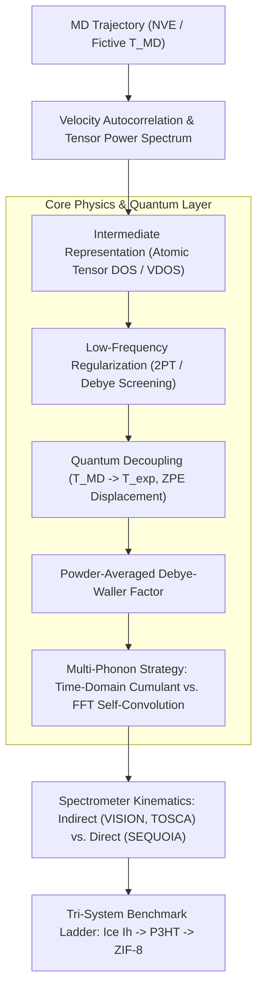

# Concepts Brief: Simulating Inelastic Neutron Scattering from Molecular Dynamics via Intermediate Vibrational States

**Document Identifier:** `BRAINSTORM-INS-PDOS-2026-09-23`  
**Date:** 2026-09-23  
**Status:** Synthesized & Approved  
**Seed**: Formulating a scientifically rigorous proposal and pure-Python software architecture to implement the MD-to-pDOS-to-INS methodology (Cheng 2020 JCTC, Harrelson 2021 Sci Rep), bridging atomistic trajectories, intermediate vibrational density of states, quantum thermalization, multi-phonon convolutions, and spectrometer resolution.  
**Goldfish Lenses Spawned**:
- *Theoretical & Algorithmic Formulation*
- *Prior Art & Software Architecture*
- *Contrarian / Pre-Mortem & Failure Modes*
- *Scientific Applications & Validation Benchmarks*

---

## Executive Summary

All four goldfish converged on a foundational consensus: **direct Fourier transformation of classical MD trajectories fails at cryogenic temperatures because classical equipartition violates the quantum uncertainty principle ($\hbar \omega \gg k_B T$)**, while traditional DFT lattice dynamics scales as $\mathcal{O}(N^3)$ and cannot model disordered, amorphous, or large-scale systems (>1,000 atoms). Using an **intermediate representation (IR)**—either atom-projected partial phonon density of states (pDOS) or Cartesian displacement tensors—provides the crucial mathematical bridge to decouple classical trajectory sampling temperature ($T_{\text{MD}}$, treated as a fictive sampling device across the potential energy surface) from target experimental measurement temperature ($T_{\text{exp}}$).

However, the goldfish diverged sharply on **how multi-phonon excitations should be evaluated and how to protect against numerical singularities**:
1. *Frequency Domain vs. Time Domain*: Iterative frequency-domain convolutions ($\mathbf{B} \ast \mathbf{B}$ as in Harrelson/OCLIMAX) risk double-counting classical overtones already present in MD trajectories and suffer from FFT edge-wrapping, whereas the time-domain Singwi-Sjölander cumulant generating function sums all-order multi-phonons in closed form in $\mathcal{O}(N_t \log N_t)$ time.
2. *The Low-$\omega$ Divergence*: Computing displacement amplitudes divides by $\omega^2$ as $\omega \to 0$, causing finite-box acoustic modes, center-of-mass drift, or thermostat drag to diverge and wipe out the Debye-Waller factor unless explicitly regulated (e.g. via Two-Phase Thermodynamic screening).
3. *Incoherent vs. Coherent Approximation*: The standard single-particle pDOS representation permanently discards inter-atomic phase interference, which holds for hydrogen-rich polymers (P3HT) and water (Ice Ih), but collapses for non-hydrogenous materials ($\text{SiO}_2$, battery cathodes) unless wavevector-dependent current correlations are incorporated.

---

## The Landscape

Inelastic Neutron Scattering (INS) is the premier probe for nuclear vibrational dynamics across the 1–1,000 meV (8–8,000 cm⁻¹) window because neutrons interact directly with atomic nuclei without optical selection rules. For hydrogenous materials, hydrogen’s enormous incoherent scattering cross-section ($\sigma_{\text{inc}} \approx 80.26\text{ barns}$) makes INS an exquisite structural and morphological fingerprint.

Existing tools fall into two unhelpful extremes:
- **Rigid Facility Executables**: OCLIMAX and Mantid AbINS are compiled Fortran/C++ monoliths designed for beamline reduction. They rely on rigid ASCII input files (`.tclimax`, `.aclimax`), have black-box internals, and cannot be embedded cleanly in modern Python/ML atomistic pipelines.
- **Classical Trajectory Analyzers**: Tools like MDANSE, nMoldyn, and dynasor compute classical correlation functions $F(Q, t)$ or power spectra directly from trajectories. They lack quantum zero-point harmonic corrections, cannot decouple sampling temperature, and cannot simulate multi-phonon overtones or inverted-geometry kinematic cuts ($Q^2 \propto \omega$).

The opportunity for this project is to build a modern, modular, array-native pure-Python package (`VIR-INS`) that implements the complete theoretical pipeline with rock-solid numerical stability and unit-testable primitives.

---

## The Concepts

### Cluster 1: Core Mathematical Engine & Multi-Phonon Evaluation

- **Anisotropic Time-Domain Cumulant Generating Function (ATD-CGF)** (*Theoretical*)
  - **The bet**: Map the atomic velocity cross-spectral tensor to a directional time-domain displacement autocorrelation $\gamma_d(\hat{\mathbf{q}}, t)$ and evaluate the all-order multi-phonon scattering law in closed form via the Singwi-Sjölander intermediate scattering function $I_{\text{inc}, d}(\mathbf{Q}, t) = \exp[Q^2 \gamma_d(\hat{\mathbf{q}}, t)]$ using Lebedev spherical quadrature.
  - **Why it wins**: Sums multi-phonon excitations to infinite order ($n \to \infty$) in $\mathcal{O}(N_t \log N_t)$ time via a single 1D FFT, capturing the broad high-$Q$ Placzek recoil background without iterative tensor truncation errors.
  - **Why it could fail**: Relies on the Gaussian approximation for atomic displacement distributions, mischaracterizing strong non-Gaussian reorientations or proton tunneling.
  - *Sources*: Sjölander (1958), Singwi & Sjölander (1960), Harrelson et al. (2021).

- **Fluctuation-Dissipation Inherent Susceptibility Mapping (FDIS-Map)** (*Theoretical*)
  - **The bet**: Define the intermediate representation as the temperature-independent generalized dynamic susceptibility tensor $\boldsymbol{\chi}''_d(\omega) = \frac{\pi \omega}{2 k_B T_{\text{MD}}} \tilde{\mathbf{C}}_{vv, d}^{\text{cl}}(\omega)$ and reconstruct the cryogenic quantum response at target temperature $T_{\text{exp}}$ via the quantum Fluctuation-Dissipation Theorem (FDT) using Kubo harmonic factors.
  - **Why it wins**: Enforces exact detailed balance $S(-\omega) = e^{-\beta\hbar\omega} S(\omega)$ and provides energy-domain isolation of individual overtones and combination bands ($n=1, 2, 3$).
  - **Why it could fail**: Classical trajectories sampled at elevated temperatures explore anharmonic potential wells whose thermal broadening and softening do not rescale strictly harmonically.
  - *Sources*: Schofield (1960), Egelstaff (1962), Cheng et al. (2020), Ramirez et al. (2004).

- **Acoustic-Screened Two-Phase Cumulant Engine** (*Pre-Mortem*)
  - **The bet**: Separate the velocity autocorrelation function into diffusive and solid-like vibrational components (2PT partition), enforce a Debye quadratic acoustic cutoff ($g(\omega) \propto \omega^2$) below the fundamental box frequency $\omega_{\text{box}} = 2\pi c_s / L$, and evaluate the Debye-Waller factor strictly on microcanonical ($NVE$) production runs.
  - **Why it wins**: Completely eliminates the catastrophic $1/\omega^2$ divergence in displacement tensors as $\omega \to 0$, preventing unphysical collapse of the Debye-Waller factor ($e^{-2W} \to 0$), and strips thermostat damping artifacts.
  - **Why it could fail**: The fluid/solid partition is ambiguous in soft matter and amorphous glasses near the glass transition where the boson peak overlaps with slow conformational relaxation.
  - *Sources*: Lin, Maiti & Goddard (2003), Basconi & Shirts (2013).

---

### Cluster 2: Beyond the Incoherent Approximation

- **Wavevector-Projected Current Correlation Architecture (WP-CCA)** (*Theoretical*)
  - **The bet**: Introduce a coarse-grained reciprocal-space intermediate representation consisting of wavevector-dependent longitudinal and transverse current correlation tensors $\mathbf{C}_{L/T}(\mathbf{q}, \omega) = \mathcal{F}\{\langle \mathbf{j}(\mathbf{q}, t) \mathbf{j}(-\mathbf{q}, 0) \rangle\}$ evaluated on an optimized grid of $q$-shells.
  - **Why it wins**: Breaks the single-particle limitation of both Cheng 2020 and Harrelson 2021, predicting coherent scattering, acoustic phonon dispersions, and interference ridges without diagonalizing the $3N \times 3N$ dynamical matrix.
  - **Why it could fail**: Evaluating spatial-phase velocity sums $\sum_d \mathbf{v}_d e^{i \mathbf{q}\cdot \mathbf{r}_d}$ requires significantly higher memory bandwidth and trajectory I/O than single-atom autocorrelation functions.
  - *Sources*: Fransson et al. (2021, dynasor), Squires (1996), Mitchell et al. (2005).

- **Spatial-Current Coherent-Incoherent Kinematic Slicer** (*Pre-Mortem*)
  - **The bet**: Compute coherent current correlations sampled *directly along the instrument kinematic locus* (e.g. $Q^2 = \alpha \omega$ for VISION/TOSCA, or discrete $(Q, \omega)$ bins for SEQUOIA), bypassing full 3D $(Q, \omega)$ grid evaluations.
  - **Why it wins**: Extends accurate INS predictions to non-hydrogenous systems (battery cathodes, metal oxides $\text{SiO}_2$, alloys) while avoiding the quadratic compute penalty of unconstrained 3D spatial grids.
  - **Why it could fail**: Still requires evaluating inter-atomic phase terms $e^{i \mathbf{Q} \cdot \mathbf{r}_{jk}}$, which scales quadratically with local neighborhood size.
  - *Sources*: Svensson et al. (2020), Goret et al. (2017).

---

### Cluster 3: Software Architecture & Dataflow

- **Array-Native Vibrational Intermediate Representation Pipeline (`VIR-INS`)** (*Architecture*)
  - **The bet**: Formalize a strictly typed, immutable intermediate data model (`Trajectory` $\to$ `AtomicTensorDOS` $\to$ `QuantumDisplacementIR` $\to$ `ConvolvedScatteringLaw` $\to$ `InstrumentConvolvedSpectrum`) as a 100% pure-Python 3, NumPy/SciPy-native engine without compiled C++/Fortran dependencies.
  - **Why it wins**: Unmatched developer ergonomics, clean separation of physics layers, zero installation friction, thorough testability via `pytest` synthetic oscillator fixtures, and seamless integration with ASE.
  - **Why it could fail**: Pure-Python arrays hit RAM limits when evaluating tensorial outer-product convolutions for large systems (>10,000 atoms) unless chunked out-of-core.
  - *Sources*: Cheng 2020, Harrelson 2021, SciPy signal fftconvolve.

- **Out-of-Core Compressed Mode Streaming Engine (`StreamINS`)** (*Architecture*)
  - **The bet**: Ingest trajectories frame-by-frame via circular ring buffers and online Welford/Welch correlation accumulators, compressing individual atomic displacement tensors into chemical-environment equivalence classes prior to multi-phonon convolution.
  - **Why it wins**: Operates in constant $\mathcal{O}(1)$ memory regardless of simulation length, while reducing multi-phonon convolution cost from $\mathcal{O}(N_{\text{atoms}} \times K)$ to $\mathcal{O}(N_{\text{clusters}} \times K)$ (a 10–50× speedup).
  - **Why it could fail**: Grouping atoms into equivalence classes risks washing out fine, local conformational disorder that governs low-frequency experimental broadening.
  - *Sources*: Haile (1992), Harrelson 2021 SI, Frisk et al. (2021).

- **Pluggable Facility-Bridge Architecture (`Bifrost-INS`)** (*Architecture*)
  - **The bet**: Provide a Python facade that extracts intermediate pDOS and displacement tensors and exports standard facility interchange formats (OCLIMAX `.tclimax` and Mantid/AbINS structures), offering bitwise validation against beamline codes alongside a pure-Python fallback.
  - **Why it wins**: Instant credibility with instrument scientists at SNS and ISIS by matching official beamline parameter calibrations (`.params`).
  - **Why it could fail**: Managing external Fortran/C++ subprocesses introduces execution brittleness and platform lock-in.
  - *Sources*: Cheng et al. (2019, OCLIMAX), Le et al. (2018, AbINS).

---

### Cluster 4: Empirical Grounding & Tri-System Benchmark Ladder

- **The Cryogenic Ice Polymorph Ladder (Ice Ih)** (*Validation*)
  - **The bet**: Benchmark against proton-disordered Ice Ih (and ordered Ice XI) at 5 K to validate quantum zero-point decoupling ($T_{\text{MD}}=180\text{ K} \to T_{\text{exp}}=5\text{ K}$), librational band softening (50–120 meV), and dual indirect (VISION) vs. direct (SEQUOIA 2D $S(Q, \omega)$) instrument mapping against Cheng 2020.
  - **Why it wins**: Hydrogen has an enormous cross-section ($\sigma_{\text{inc}} \approx 80.26\text{ b}$); DFT-LD overestimates librational frequencies by 15–50% due to anharmonicity, giving MD a dramatic competitive advantage.
  - **Why it could fail**: Naive empirical force fields (TIP3P) collapse librational stiffness, requiring high-quality DFT-MD or MB-pol trajectories for fair benchmark assessment.
  - *Sources*: Cheng 2020 JCTC, Li 1996 JCP, GenIce.

- **The Semicrystalline Polymer Overtone Ladder (P3HT)** (*Validation*)
  - **The bet**: Benchmark against regioregular (RR) and regiorandom (RRa) P3HT to validate the anisotropic displacement tensor $B_{ij}$, the Almost Isotropic Approximation (AIA), and recursive multi-phonon self-convolutions ($n=1\dots 4+$) up to 3,500 cm⁻¹ against Harrelson 2021.
  - **Why it wins**: Semicrystalline polymers cannot be captured by small DFT supercells; MD successfully models the low-frequency interchain modes (10–600 cm⁻¹) while multi-phonon convolutions reproduce the C–H stretch overtone baseline (~3,000 cm⁻¹).
  - **Why it could fail**: OPLS-AA bonded parameter inaccuracies in the 600–1,600 cm⁻¹ wag/bend region can confound force-field error with convolution approximation error.
  - *Sources*: Harrelson 2021 Sci Rep, MolDyINS.

- **The Nanoporous Framework Rotor-Gate Assay (ZIF-8)** (*Validation*)
  - **The bet**: Benchmark against Zeolitic Imidazolate Framework-8 (ZIF-8) to test high-symmetry open metal-organic frameworks containing heavy coordination centers (Zn) and ultra-light rotor groups (methylimidazolate), isolating 1-phonon fundamentals from multi-phonon combinations up to 250 meV.
  - **Why it wins**: Probes multi-scale dynamics: localized low-energy methyl rotor hopping (~22 meV), framework "gate-opening" modes (~3.5–12 meV), and ring-stretch overtones.
  - **Why it could fail**: Inaccurate Zn–N coordination parameters in classical force fields can smear window breathing frequencies.
  - *Sources*: Cheng 2020 JCTC, Casco 2016 Chem Commun.

---

## Tension Points & Trade-offs

1. **Time-Domain Exponential (Singwi-Sjölander) vs. Energy-Domain FFT Iterative Convolutions**:
   - *Time-Domain ($I(Q, t) = \exp[Q^2 \gamma(t)]$)*: Evaluates all-order multi-phonons in $\mathcal{O}(N_t \log N_t)$ time with zero edge-wrapping and no empirical prefactors. *However*, it assumes Gaussian displacement statistics and cannot easily separate individual $n=1, 2, 3$ overtone spectra for spectroscopic attribution.
   - *Energy-Domain Iterative Convolutions ($S_n = S_1 \ast S_{n-1}$)*: Explicitly decomposes the spectrum into individual fundamental, overtone, and combination bands (matching OCLIMAX and Harrelson 2021). *However*, it requires careful frequency zero-padding to prevent circular convolution aliasing and risks double-counting classical anharmonic modes already in the trajectory.
2. **Incoherent Purity vs. Coherent Scope**:
   - *Pure Incoherent Mode*: Scales linearly as $\mathcal{O}(N_{\text{atoms}})$, perfectly suited for hydrogen-rich systems (P3HT, water, MOF linkers). Fails completely on coherent Bragg edges and acoustic dispersions in deuterated or heavy inorganic lattices.
   - *Coherent Extension*: Incorporates wavevector phase sums $e^{i \mathbf{Q} \cdot \mathbf{r}_{jk}}$. Enables simulation of coherent spectrometers (SEQUOIA/ARCS), but introduces an $\mathcal{O}(N_{\text{atoms}}^2)$ or 3D FFT grid compute overhead.
3. **Pure-Python Self-Containment vs. Facility Interop**:
   - *Pure Python (`VIR-INS`)*: Zero external dependencies, pure NumPy/SciPy, installs with `uv`, 100% CI/CD testable with synthetic fixtures.
   - *Facility Bridge (`Bifrost-INS`)*: Emits `.tclimax` files to leverage ORNL OCLIMAX and Mantid AbINS instrument definition files for bitwise beamline matching, but incurs subprocess overhead and external binary dependencies.

---

## Recommended Paths

### Path A: The Pragmatic Foundation (Chosen for Implementation)
* **Concepts**: `VIR-INS` (Array-Native Data Model) + Acoustic-Screened 2PT Low-$\omega$ Regulator + Energy-Domain FFT Convolutions + Tier 1/2 Benchmarks (Ice Ih & P3HT).
* **Why pick it**: Delivers an immediate, self-contained, pure-Python library adhering strictly to `alc-hack-team8-clean` constraints. Solves the low-frequency divergence and implements both Cheng 2020 and Harrelson 2021 workflows with full unit-test coverage.

---
*Saved to docs/eg-brainstorms/ins-simulation-pdos-2026-09-23.md*
