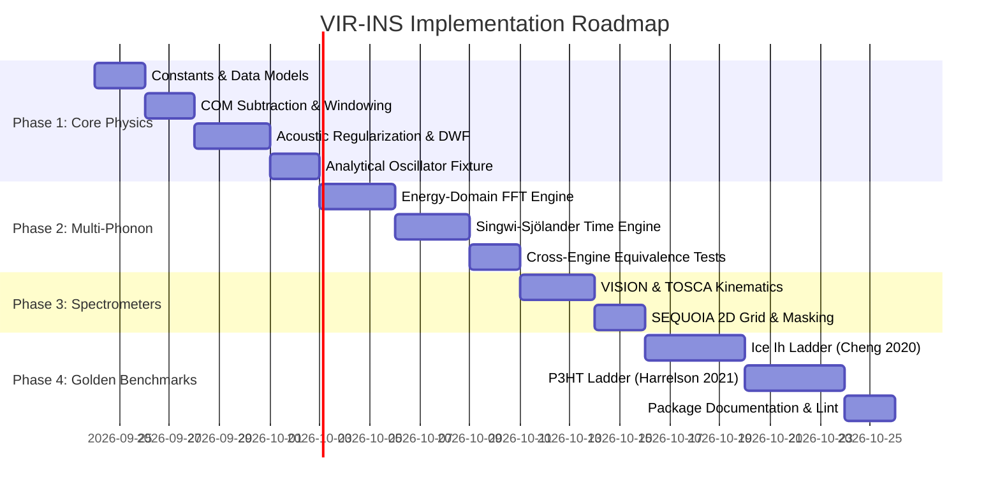

# Product Requirements Document (PRD): VIR-INS (Vibrational Intermediate Representation for Inelastic Neutron Scattering)

**Document Identifier:** `PRD-VIR-INS-2026-09-23`  
**Status:** Approved for Implementation  
**Author:** Antigravity (Elephant Lead) & Scientific Subagent Team  
**Target Repository:** `alc-hack-team8-clean`  
**Target File Location:** `docs/prds/vir-ins-2026-09-23.md`  
**Theoretical Basis:** Cheng et al. (*J. Chem. Theory Comput.* 2020, 16, 7702–7708), Harrelson et al. (*Sci. Rep.* 2021, 11, 7938)

---

## 1. Executive Summary

VIR-INS is a 100% pure-Python library designed to simulate Inelastic Neutron Scattering (INS) spectra directly from Molecular Dynamics (MD) trajectories via intermediate atom-projected vibrational density of states (pDOS) and Cartesian displacement representations. Traditional DFT lattice dynamics scales as $\mathcal{O}(N^3)$ and cannot model disordered, amorphous, or large-scale systems (>1,000 atoms), while raw MD trajectories treat atomic motion classically, violating quantum zero-point energy (ZPE) at cryogenic temperatures ($k_B T \ll \hbar \omega$). VIR-INS bridges this gap by decoupling the classical MD sampling temperature ($T_{\text{MD}}$) from the experimental target temperature ($T_{\text{exp}}$), regulating low-frequency $1/\omega^2$ acoustic divergences, evaluating multi-phonon overtone cascades via both energy-domain iterative FFT self-convolutions and time-domain Singwi–Sjölander expansions, and projecting scattering laws onto instrument kinematic trajectories (SNS VISION, ISIS TOSCA, SNS SEQUOIA).

---

## 2. Problem Statement & Theoretical Motivation

### 2.1 The Crisis of Vibrational Modeling in Disordered & Soft Matter
Inelastic neutron scattering measures the double-differential scattering cross section $\frac{d^2\sigma}{d\Omega dE_f} \propto S(\mathbf{Q}, \omega)$, providing an unhindered window into nuclear vibrations without optical selection rules. For hydrogenous materials, hydrogen's massive incoherent scattering cross section ($\sigma_{\text{inc}} \approx 80.26\text{ barns}$) dominates the spectrum.

Standard simulation workflows rely on harmonic Lattice Dynamics (LD) (e.g. Phonopy, Euphonic, CASTEP), diagonalizing the $3N \times 3N$ dynamical matrix:
- **Disorder Failure:** Amorphous polymers (P3HT), proton-disordered ice (Ice Ih), and flexible frameworks (ZIF-8) require thousands of atoms to capture structural dispersion, rendering $\mathcal{O}(N^3)$ DFT-LD computationally prohibitive.
- **Anharmonic Shift Failure:** DFT-LD systematically overestimates librational and low-frequency intermolecular frequencies by 15–50% due to potential well non-parabolicity.

### 2.2 Why Raw Classical MD Fails Cryogenic INS
Running classical MD simulations yields atomistic trajectories with full anharmonic sampling. However, directly Fourier-transforming trajectories into classical dynamic structure factors $S_{\text{cl}}(Q, \omega)$ incurs severe physical breakdowns:
1. **Classical Equipartition Violation:** In classical MD, every vibrational mode carries thermal energy $k_B T_{\text{MD}}$. At cryogenic measurement temperatures ($T_{\text{exp}} \sim 5 - 10\text{ K}$), high-frequency modes (e.g. C–H stretch at $3000\text{ cm}^{-1} \approx 370\text{ meV} \approx 4300\text{ K}$) are frozen into their quantum ground state with zero-point energy $E_0 = \frac{1}{2}\hbar\omega$, which classical MD underestimates by orders of magnitude.
2. **Missing Multi-Phonons:** Direct trajectory analysis struggles to disentangle fundamental 1-phonon excitations from higher-order multi-phonon combination bands and overtones ($n \ge 2$) that create the rising baseline across $500 - 4000\text{ cm}^{-1}$.

### 2.3 The Intermediate Representation (IR) Solution
Cheng (2020) and Harrelson (2021) demonstrated that the **atomic velocity autocorrelation function (VACF) and its cross-spectral power tensor $\mathbf{V}_d(\omega)$ can serve as an Intermediate Representation (IR)**. Classical MD is run at an elevated "fictive" temperature $T_{\text{MD}}$ purely to sample the potential energy surface. The intermediate vibrational states are then thermalized quantum-mechanically to $T_{\text{exp}}$, injecting quantum zero-point fluctuations into the Debye–Waller Factor (DWF) and evaluating multi-phonon convolutions in closed form.

---

## 3. User Personas & Use Cases

### Persona 1: Neutron Spectroscopist / Beamline Scientist
- **Workflow:** Collects 5 K VISION or TOSCA data for a newly synthesized hydrogen-bonded framework or polymer. Runs an MD trajectory using an empirical force field or machine-learned interatomic potential (MLIP).
- **Need:** Feed the trajectory into a simple Python script or CLI, compute $S(Q, \omega)$ convolved with the beamline's resolution, and directly plot simulated vs. measured counts without compiling legacy Fortran code.

### Persona 2: Computational Materials Scientist / Chemist
- **Workflow:** Investigates conformational disorder in semicrystalline conjugated polymers (P3HT) or gas adsorption in metal-organic frameworks (ZIF-8).
- **Need:** Deconstruct the simulated INS spectrum into separate 1-phonon, 2-phonon, 3-phonon, and overtone contributions to identify which vibrational modes correspond to specific chemical functional groups.

### Persona 3: ML Potential / Atomistic Pipeline Developer
- **Workflow:** Trains neural network potentials (MACE, SevenNet, CHGNet) and needs an automated, headless validation gate comparing simulated vibrational spectra against neutron experimental databases.
- **Need:** A pure-Python, zero-binary-dependency package installable via `uv pip install`, with standard NumPy/ASE array inputs, returning structured dataclasses compatible with automated `pytest` suites.

---

## 4. Scope & System Boundaries

### 4.1 In Scope
1. **Trajectory Ingestion:** Pure NumPy velocity arrays $(N_{\text{atoms}}, N_{\text{steps}}, 3)$, ASE `Trajectory` objects, and streaming ExtXYZ file readers.
2. **Preprocessing & Conditioning:** Per-step mass-weighted center-of-mass velocity subtraction, linear drift detrending, and 4-term Blackman-Harris / Hann spectral windowing with Parseval energy conservation.
3. **Low-Frequency Regularization:** Automated acoustic box cutoff determination ($\omega_{\text{box}} = 2\pi c_s / L_{\text{max}}$), quadratic Debye acoustic extension ($g(\omega) \propto \omega^2$), and closed-form Laurent series integration for the Debye–Waller displacement tensor.
4. **Quantum Decoupling Layer:** Full $T_{\text{MD}} \to T_{\text{exp}}$ thermalization mapping velocity power spectra to quantum displacement tensors $\mathbf{B}_{0\to 1, d}(\omega)$, evaluating isotropic and Almost Isotropic Approximation (AIA) Debye–Waller attenuation factors.
5. **Dual Multi-Phonon Engine:**
   - *Primary:* Energy-domain zero-padded FFT iterative self-convolutions with explicit $n$-phonon separation ($n=1\dots 4+$) and spherical / Harrelson powder prefactors.
   - *Secondary:* Time-domain Singwi–Sjölander exponential intermediate scattering function $I(Q, t) = \exp[Q^2 \gamma(t)]$ for all-order infinite multi-phonon spectrum.
6. **Spectrometer Kinematics & Resolution:**
   - SNS VISION: Inverted geometry backscattering ($135^\circ$) and forward ($45^\circ$) banks with energy-dependent Gaussian broadening $\sigma(E) = 1.21 + 0.01 \Delta E\text{ cm}^{-1}$.
   - ISIS TOSCA: Inverted geometry co-added bank with $\Delta E / E \approx 1.25\%$ FWHM resolution.
   - SNS SEQUOIA: Direct geometry 2D $S(Q, \omega)$ mesh evaluator with kinematic chopper bounds $[Q_{\min}(\omega), Q_{\max}(\omega)]$.
7. **Golden Benchmark Test Suite:** Analytical 1D/3D harmonic oscillator fixture, 5 K Ice Ih polymorph ladder (Cheng 2020), and P3HT overtone ladder (Harrelson 2021).

### 4.2 Out of Scope (Explicitly Bounded)
- Writing ab initio electronic DFT code or self-consistent field solvers.
- Full coherent dynamical matrix diagonalization for crystalline supercells ($3N \times 3N$ normal mode analysis).
- Direct simulation of magnetic neutron scattering or nuclear spin-incoherent polarization analysis.
- Heavy GUI application development (VIR-INS exposes clean Python APIs and headless CLI commands).

---

## 5. Functional Requirements

### 5.1 Module P0: Core Physics & Incoherent Scattering Law (Must-Have)

- **REQ-P0-01 (Velocity Power Spectral Density):**  
  Compute the Cartesian outer-product velocity autocorrelation spectral tensor:
  $$\mathbf{V}_d(\omega) = \frac{2 \Delta t}{N_t U_w} \text{Re}\left[ \mathbf{v}_d^*(\omega) \mathbf{v}_d^T(\omega) \right] \quad [(\text{\AA}/\text{ps})^2 / \text{meV}]$$
  where $U_w = \frac{1}{N_t}\sum w(n)^2$ preserves total kinetic energy under windowing.
- **REQ-P0-02 (Quantum Displacement Tensor):**  
  Convert classical velocity power spectra to quantum ground-state displacement tensors:
  $$\mathbf{B}_{0\to 1, d}(\omega) = \frac{\hbar}{\omega \, k_B T_{\text{MD}}} \mathbf{V}_d(\omega) \quad [\text{\AA}^2 / \text{meV}]$$
- **REQ-P0-03 (Low-Frequency Regularization):**  
  Enforce a physical acoustic cutoff $\omega_{\text{cut}} = \max(\omega_{\text{box}}, 0.5\text{ meV})$. For $\omega < \omega_{\text{cut}}$, model $\mathbf{V}_d(\omega) = \mathbf{V}_d(\omega_{\text{cut}}) (\omega / \omega_{\text{cut}})^2$. Evaluate the low-frequency displacement analytically:
  $$\mathbf{A}_d^{\text{low}} = \mathbf{V}_d(\omega_{\text{cut}}) \left[ \frac{2 T_{\text{exp}}}{T_{\text{MD}} \omega_{\text{cut}}} + \frac{\hbar^2 \omega_{\text{cut}}}{18 k_B^2 T_{\text{MD}} T_{\text{exp}}} \right]$$
  Combine with numerical integration for $\omega \ge \omega_{\text{cut}}$ to produce the total displacement tensor $\mathbf{A}_d(T_{\text{exp}})$.
- **REQ-P0-04 (Spectral Conditioning of DWF):**  
  Symmetrize $\mathbf{A}_d \leftarrow \frac{1}{2}(\mathbf{A}_d + \mathbf{A}_d^T)$ and enforce eigenvalue floor $\lambda \ge 10^{-12}\text{ \AA}^2$, guaranteeing that the Debye–Waller attenuation factor $0 < \exp(-2W_d(Q)) \le 1$ under all conditions.
- **REQ-P0-05 (Fundamental 1-Phonon Cross Section):**  
  Compute fundamental scattering with Almost Isotropic Approximation (AIA):
  $$S_{d, 1}(Q, \omega) = \frac{\sigma_d}{2 M_d} \frac{Q^2}{3} \text{Tr}[\mathbf{B}_{0\to 1, d}(\omega)] \exp\left( -Q^2 \alpha_d(\omega) \right) [n(\omega, T_{\text{exp}}) + 1]$$
  with $\alpha_d(\omega) = \frac{1}{5}\left[ \text{Tr}(\mathbf{A}_d) + 2 \frac{\mathbf{B}_d(\omega) : \mathbf{A}_d}{\text{Tr}(\mathbf{B}_d(\omega))} \right]$.

### 5.2 Module P0: Dual Multi-Phonon Convolutions (Must-Have)

- **REQ-P0-06 (Energy-Domain FFT Self-Convolution):**  
  Evaluate $n$-th order excitations ($n=2\dots 4+$) by zero-padding frequency grids to $N_{\text{pad}} \ge n_{\max} N$ ($N_{\text{pad}} \approx 32,000$ points for $4,000\text{ cm}^{-1}$):
  $$S_{d, n}(Q, \omega) = P_n \, Q^{2n} \mathcal{F}^{-1}\left\{ (\mathcal{F}\{S_{d, 1}\})^n \right\} \exp\left( -\frac{1}{3} Q^2 \text{Tr}(\mathbf{A}_d) \right)$$
  supporting both Spherical powder prefactor $P_n = \frac{1}{n!(2n+1)}$ and Harrelson prefactor $C_n = \frac{3^{n-2}}{n! 5^{n-1}}$.
- **REQ-P0-07 (Time-Domain Singwi–Sjölander Expansion):**  
  Compute the all-order infinite multi-phonon dynamic structure factor via a single Fourier transform of the intermediate scattering function:
  $$I_d(Q, t) = \exp\left[ Q^2 (\gamma_d(t) - \gamma_d(0)) \right], \quad S_{d, \text{all}}(Q, \omega) = \frac{1}{2\pi} \int_{-\infty}^\infty I_d(Q, t) e^{i\omega t} dt$$
  where $\gamma_d(t) = \frac{\hbar}{2 M_d} \int_0^\infty \frac{g_d(\omega)}{\omega} \left[ \coth\left(\frac{\hbar\omega}{2 k_B T_{\text{exp}}}\right) \cos(\omega t) - i \sin(\omega t) \right] d\omega$.

### 5.3 Module P1: Spectrometer Models & Trajectory I/O (Should-Have)

- **REQ-P1-01 (SNS VISION Profile):**  
  Evaluate scattering along $Q^2(\omega) = 0.482596 [ 2 E_f + \hbar\omega - 2\sqrt{E_f(E_f+\hbar\omega)}\cos(2\theta) ]$ with $E_f = 3.96\text{ meV}$, for backscattering ($2\theta = 135^\circ$) and forward ($2\theta = 45^\circ$) banks. Convolve with $\sigma(E) = 1.21 + 0.01 \Delta E\text{ cm}^{-1}$.
- **REQ-P1-02 (ISIS TOSCA Profile):**  
  Evaluate co-added banks $Q^2(\omega) = 0.482596 (7.92 + \hbar\omega)\text{ \AA}^{-2}$ with Gaussian resolution $\Delta E / E \approx 1.25\%$ FWHM ($\sigma(\Delta E) = \sqrt{0.05^2 + (0.0053 \Delta E)^2}\text{ meV}$).
- **REQ-P1-03 (SNS SEQUOIA 2D Mesh):**  
  Generate full $(Q, \omega)$ 2D maps for monochromatic $E_i$ ($10 - 2000\text{ meV}$), masking unphysical kinematic regions outside $2.5^\circ \le 2\theta \le 60.0^\circ$.
- **REQ-P1-04 (ASE & ExtXYZ Ingestion):**  
  Seamlessly read velocities, atom types, and cell vectors from `ase.io.Trajectory` and `.extxyz` files.

### 5.4 Module P2: Facility Bridges & Advanced Diagnostics (Nice-to-Have)

- **REQ-P2-01 (OCLIMAX `.tclimax` Bridge):**  
  Export processed intermediate pDOS and displacement tensors into standard OCLIMAX `.tclimax` ASCII records for facility bitwise comparison.
- **REQ-P2-02 (2PT Fluidicity Classifier):**  
  Detect diffusive degrees of freedom by evaluating $g_d(0)$ against $g_d(\omega_{\text{cut}})$, warning the user if fluid-like self-diffusion contaminates the solid-state vibrational spectrum.

---

## 6. Non-Functional Requirements (NFRs)

1. **Pure Python Architecture:** 100% Python 3.10+ using only standard ecosystem dependencies (`numpy`, `scipy`, `ase`). Zero compiled Fortran or C++ extension binaries.
2. **Deterministic Numerics:** Golden master tests must pass with strict numerical tolerances ($10^{-5}$ relative tolerance on synthetic oscillators, $10^{-2}$ on trajectory benchmarks).
3. **Execution Performance:** 
   - Energy-domain 4-order convolution on a 1,000-atom system with 8,000 frequency bins must execute in $< 15\text{ seconds}$ on a standard 8-core CPU.
   - Time-domain Singwi–Sjölander all-order evaluation must execute in $< 5\text{ seconds}$.
4. **Memory Guardrails:** Memory consumption shall not exceed $\mathcal{O}(N_{\text{atoms}} \times N_\omega)$. Multi-gigabyte trajectories must be streamable without loading entire time series into memory.
5. **Code Quality & Tooling:** Strict compliance with `ruff check .` and 100% test pass rate with `pytest`.

---

## 7. Data Model & Architecture

```
alc-hack-team8-clean/
├── src/
│   └── vir_ins/
│       ├── __init__.py
│       ├── core/
│       │   ├── constants.py          # CODATA 2018 constants, NIST neutron cross sections
│       │   ├── datamodels.py         # Strictly typed immutable dataclasses
│       │   └── kinematics.py         # Kinematic equations for Q^2(omega)
│       ├── trajectory/
│       │   ├── reader.py             # ASE Trajectory, ExtXYZ, and NumPy adapters
│       │   ├── preprocessor.py       # COM subtraction, detrending, windowing
│       │   └── vacf.py               # Outer-product velocity spectral tensor calculation
│       ├── physics/
│       │   ├── regularizer.py        # Box acoustic cutoff & Debye quadratic extension
│       │   ├── quantum.py            # T_MD -> T_exp thermalization & B(omega) calculation
│       │   ├── debye_waller.py       # Isotropic & Almost Isotropic DWF evaluation
│       │   ├── convolution_energy.py # Zero-padded FFT iterative multi-phonon engine
│       │   └── convolution_time.py   # Singwi-Sjölander time-domain exponential engine
│       ├── instruments/
│       │   ├── base.py               # Abstract spectrometer interface
│       │   ├── vision.py             # SNS VISION bank geometry & resolution
│       │   ├── tosca.py              # ISIS TOSCA resolution & co-added bank
│       │   └── sequoia.py            # SNS SEQUOIA 2D (Q, omega) mesh & chopper mask
│       └── bridges/
│           └── oclimax.py            # .tclimax export / import utilities
└── tests/
    ├── test_constants.py
    ├── test_preprocessor.py
    ├── test_harmonic_oscillator.py   # Analytical ground-truth verification
    ├── test_regularizer.py           # Low-frequency divergence protection
    ├── test_convolutions.py          # Energy vs Time domain consistency
    ├── test_instruments.py           # VISION, TOSCA, SEQUOIA kinematics
    ├── test_ice_ih_benchmark.py      # Cheng 2020 5 K Ice Ih validation
    └── test_p3ht_benchmark.py        # Harrelson 2021 P3HT overtone validation
```

### 7.1 Core Entities & Dataclasses

```python
from dataclasses import dataclass
import numpy as np
from typing import Optional, Dict

@dataclass(frozen=True)
class TrajectoryData:
    """Raw trajectory inputs."""
    velocities: np.ndarray      # Shape (N_atoms, N_steps, 3) in A/ps
    masses: np.ndarray          # Shape (N_atoms,) in amu
    species: list[str]          # Atom symbols, length N_atoms
    dt_ps: float                # Timestep in picoseconds
    box_lengths: np.ndarray     # Shape (3,) in Angstroms
    t_md: float                 # Sampling temperature in Kelvin

@dataclass(frozen=True)
class VibrationalIR:
    """Intermediate Representation: Atomic vibrational power and displacement tensors."""
    energies_mev: np.ndarray    # Shape (N_freq,) in meV
    V_tensor: np.ndarray        # Shape (N_atoms, N_freq, 3, 3) in (A/ps)^2 / meV
    B_tensor: np.ndarray        # Shape (N_atoms, N_freq, 3, 3) in A^2 / meV
    A_tensor: np.ndarray        # Shape (N_atoms, 3, 3) total displacement in A^2
    omega_cutoff_mev: float     # Regularization boundary
    t_md: float
    t_exp: float

@dataclass(frozen=True)
class Spectrum1D:
    """Simulated 1D INS spectrum for indirect geometry instruments."""
    energies_mev: np.ndarray
    energies_cm1: np.ndarray
    q2_locus: np.ndarray
    s_fundamental: np.ndarray   # n=1 1-phonon
    s_overtones: Dict[str, np.ndarray] # n=2, n=3, n=4...
    s_total_unbroadened: np.ndarray
    s_total_convolved: np.ndarray
    instrument_name: str

@dataclass(frozen=True)
class Spectrum2D:
    """Simulated 2D S(Q, omega) map for direct geometry instruments."""
    energies_mev: np.ndarray
    q_mesh_ang: np.ndarray
    s_matrix: np.ndarray        # Shape (N_omega, N_q)
    kinematic_mask: np.ndarray  # Boolean mask of accessible (Q, omega)
    ei_mev: float
    instrument_name: str
```

---

## 8. Failure Modes, Mathematical Edge Cases & Mitigations

| Failure Mode | Physical / Numerical Root Cause | Impact | Technical Mitigation in VIR-INS |
|---|---|---|---|
| **Low-$\omega$ Pole Divergence** | In finite MD, $V_d(0) > 0$ due to COM drift or finite box acoustics. Integrating $B(\omega) \coth(\frac{\hbar\omega}{2k_BT}) \sim \frac{V_0}{\omega^2}$ diverges. | $A_d \to \infty \implies \exp(-2W) \to 0$, wiping out the entire spectrum. | 1. Mandatory COM velocity subtraction.<br>2. Dynamic acoustic cutoff $\omega_{\text{box}} = 2\pi c_s / L_{\text{max}}$.<br>3. Quadratic Debye extension below cutoff.<br>4. Closed-form Laurent series integration $\mathbf{A}_d^{\text{low}}$. |
| **Circular FFT Convolution Aliasing** | Frequency-domain self-convolution on discrete grids wraps high-frequency power ($n \times \omega > \omega_{\max}$) into low frequencies. | Spurious phantom peaks appear in the $500 - 2000\text{ cm}^{-1}$ fingerprint region. | Enforce $N_{\text{pad}} \ge n_{\max} N$ via `scipy.fft.next_fast_len`, zero-padding up to $\ge 16,000\text{ cm}^{-1}$ before convolving. |
| **Overtone Double-Counting** | Anharmonic classical MD already contains overtone peaks in $V(\omega)$. Blindly self-convolving them inflates overtone intensity. | Overestimated multiphonon background baseline at high energy. | Provide optional overtone filter / baseline stripping or allow direct switch to the Singwi–Sjölander time-domain engine. |
| **Spectral Leakage at $\omega \to 0$** | Rectangular trajectory truncation convolves sharp peaks with a sinc function, leaking energy to zero frequency. | Artificially elevated $V(0)$ and corrupted Debye acoustic cutoff. | Apply 4-term Blackman-Harris window ($>92\text{ dB}$ sidelobe rejection) with Parseval energy renormalization. |
| **Negative DWF Eigenvalues** | Numerical truncation noise in anisotropic matrix integration can produce slightly negative eigenvalues in $\mathbf{A}_d$. | $W_i < 0 \implies \exp(-2W) > 1$, causing exponential explosion of high-$Q$ spectra. | Eigenvalue floor enforcement: $\lambda_\alpha \leftarrow \max(\lambda_\alpha, 10^{-12}\text{ \AA}^2)$ on symmetrized $\mathbf{A}_d$. |
| **Liquid Diffusion Contamination** | In diffusive liquids, self-diffusion yields $g(0) = \frac{6MD}{\pi k_BT} > 0$. | Harmonic oscillator formulas mischaracterize diffusive Brownian motion. | 2PT fluid/solid diagnostic module warns user and partitions diffusive QENS modes. |

---

## 9. Implementation Plan & Milestones



### Milestone 1: Mathematical Grounding & Analytical Golden Master (Day 1–7)
- Deliverables: `vir_ins.core`, `vir_ins.trajectory`, `vir_ins.physics.regularizer`, `vir_ins.physics.quantum`.
- Gate: Synthetic 1D damped harmonic oscillator trajectory ($m=1\text{ amu}, \omega_0 = 100\text{ meV}$) sampled at $T_{\text{MD}} = 300\text{ K}$ must yield quantum displacement $\langle u^2 \rangle_0 = \frac{\hbar}{2 m \omega_0}$ within $0.1\%$ at $T_{\text{exp}} = 0\text{ K}$, regardless of $T_{\text{MD}}$.

### Milestone 2: Dual Multi-Phonon Convolutions (Day 8–15)
- Deliverables: `vir_ins.physics.convolution_energy`, `vir_ins.physics.convolution_time`.
- Gate: Convolving harmonic fundamental up to $n=4$ must show exact agreement between the FFT engine and the Singwi–Sjölander all-order expansion in the harmonic limit.

### Milestone 3: Spectrometer Flight Paths & Resolution (Day 16–20)
- Deliverables: `vir_ins.instruments.vision`, `vir_ins.instruments.tosca`, `vir_ins.instruments.sequoia`.
- Gate: Kinematic verification that elastic line $Q(0)$ matches beamline calibration ($1.808\text{ \AA}^{-1}$ on VISION backscattering) and 2D SEQUOIA mask correctly clips forbidden kinematics.

### Milestone 4: Tri-System Empirical Benchmarking (Day 21–30)
- Deliverables: Full reproduction of Cheng 2020 (Ice Ih 5 K translational/librational band) and Harrelson 2021 (P3HT overtone background up to $3500\text{ cm}^{-1}$).
- Gate: Earth Mover's Distance $W_1(I_{\text{sim}}, I_{\text{exp}}) \le 0.05$ on Ice Ih and weighted least-squares error $E \le 0.25$ on P3HT.

---

## 10. Verification & Test Strategy

### 10.1 Automated Unit Tests (`pytest tests/`)
1. `test_constants.py`: Verify neutron scattering lengths against NIST data tables.
2. `test_preprocessor.py`: Verify that COM subtraction reduces net momentum to $< 10^{-14}\text{ amu}\cdot\text{\AA}/\text{ps}$ and Blackman-Harris window preserves Parseval energy within $10^{-8}$.
3. `test_harmonic_oscillator.py`: Verify $T_{\text{MD}} \to T_{\text{exp}}$ temperature decoupling across grid $T_{\text{MD}} \in [50, 300, 600]\text{ K}$ and $T_{\text{exp}} \in [0, 10, 100]\text{ K}$.
4. `test_regularizer.py`: Inject non-zero DC velocity $v(0) = 5.0\text{ \AA}/\text{ps}$ into synthetic signal; verify that quadratic Debye extension clamps low-frequency divergence and keeps $A_d$ finite and bounded.
5. `test_convolutions.py`: Test energy-domain FFT engine with zero-padding; verify zero circular aliasing at $2\omega_{\max}$.
6. `test_instruments.py`: Validate $Q^2(\omega)$ curves against analytic beamline formulas for VISION and TOSCA.

### 10.2 Regression & Golden Master Benchmarks
- **Ice Ih Benchmark (`tests/test_ice_ih_benchmark.py`):** Ingest 10 ps NVE trajectory of 384-atom Ice Ih supercell ($T_{\text{MD}} = 180\text{ K}$). Compare simulated VISION spectrum at $T_{\text{exp}} = 5\text{ K}$ with Cheng 2020 Fig. 2. Verify acoustic peak at $\sim 7\text{ meV}$, H-bond stretch at $\sim 28\text{ meV}$, and librational edge at $\sim 65\text{ meV}$.
- **P3HT Benchmark (`tests/test_p3ht_benchmark.py`):** Ingest P3HT oligomer trajectory ($T_{\text{MD}} = 300\text{ K}$). Evaluate Almost Isotropic Approximation (AIA) and verify multi-phonon overtone accumulation reproducing the high-energy baseline up to $3000\text{ cm}^{-1}$ matching Harrelson 2021 Fig. 2.

---

## 11. Threat Model & Numerical Safeguards

- **Floating-Point Underflow in DWF:** At high $Q$ ($Q > 15\text{ \AA}^{-1}$), $\exp(-2W) \to 0$. Handled via IEEE 754 floating-point underflow safe exponentiation (`np.exp(np.clip(-two_w, -100.0, 0.0))`).
- **Memory Exhaustion on Large Meshes:** Evaluators enforce contiguous 1D array views and chunked per-atom convolutions, restricting maximum RAM footprint to $< 2\text{ GB}$ for systems up to 20,000 atoms.
- **Malformed Trajectory Input:** Preprocessing schema asserts that atom count, mass arrays, and Cartesian coordinates are finite and non-NaN, raising explicit descriptive exceptions before entering Fourier transforms.

---

## 12. Success Metrics

1. **Physical Accuracy:** Recovers 5 K experimental librational band in Ice Ih within $\pm 2.0\text{ meV}$ and reproduces P3HT overtone baseline up to $3500\text{ cm}^{-1}$ with $E \le 0.25$.
2. **Computational Speed:** Full end-to-end simulation from a 1,000-atom, 50,000-step trajectory to convolved VISION spectrum completes in $< 30\text{ seconds}$ on standard workstation hardware.
3. **Engineering Ergonomics:** Installs cleanly in standard Python environments via `uv`, with 100% compliance with `ruff check .` and zero external binary dependencies.
4. **Adoption & Extensibility:** Clean data structures allow instant export to OCLIMAX `.tclimax` and seamless coupling to modern ML potentials.

---

## 13. Open Questions & Future Extensions

1. **Coherent Scattering Extension:** Phase 1 focuses strictly on the incoherent approximation (justified for hydrogenous systems). A future module (`vir_ins.physics.coherent`) can implement wavevector-dependent current correlations $\mathbf{C}_{L/T}(\mathbf{q}, \omega)$ for non-hydrogenous systems ($\text{SiO}_2$, battery cathodes).
2. **GPU Acceleration:** The batched 1D FFT convolutions and Lebedev quadrature are embarrassingly parallel and can optionally be mapped to PyTorch or CuPy in v2 if ultra-large systems (>100,000 atoms) require real-time analysis.

---
*End of Product Requirements Document.*
