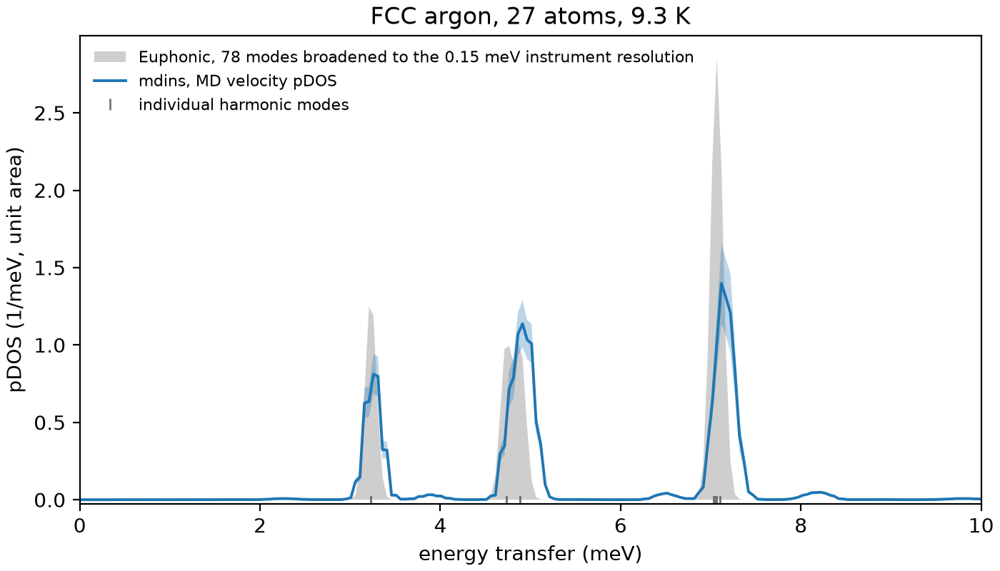
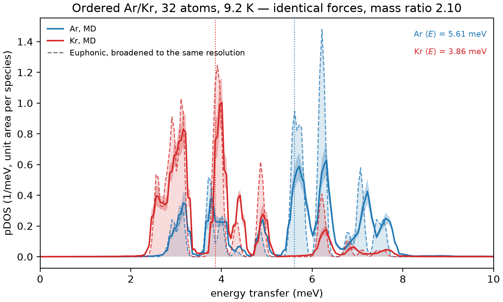
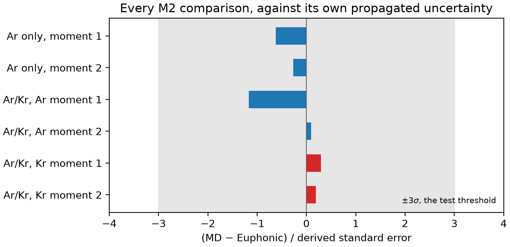

# Harmonic validation of the mdins pDOS

**Status:** milestone M2, complete. Every number and figure here is produced by
`tests/test_euphonic.py` and `docs/make_validation_figures.py`, which share the harness
in `tests/lj_reference.py`.

## What is being tested, and why this way

The mdins pipeline turns MD velocities into a phonon density of states. Stage A reads the
trajectory, stage B forms the velocity cross-spectral density by Welch's method, stage C
normalises it against equipartition. An error anywhere in that chain — a factor of 2π, a
wrong dump interval, a mis-scaled window — produces a spectrum that still *looks*
plausible. Self-consistency checks cannot catch it, because the same wrong constant
appears on both sides.

So the test compares against something that shares no code with the pipeline. The same
Lennard-Jones crystal is described twice:

```
ASE LennardJones ──┬── finite displacement → force constants → Euphonic → phonons
                   └── NVE MD, low T       → mdins → pdos()
```

The upper route diagonalises the dynamical matrix and never integrates an equation of
motion. The lower route integrates the real dynamics and never diagonalises anything.
The only thing they have in common is the potential. If they agree, the pipeline is
doing what it claims.

Two conditions have to hold for the comparison to be meaningful, and both are the
test's responsibility rather than the code's:

- **The reference must use the q-grid commensurate with the MD supercell.** An *n*×*n*×*n*
  supercell under periodic boundaries can host exactly *n*³ wavevectors. Sampling the
  reference more finely adds modes the MD was never able to support, and the comparison
  then fails for a reason that has nothing to do with mdins.
- **The MD must be cold enough to stay harmonic.** The reference *is* the harmonic
  answer, so real anharmonicity is a genuine physical difference, not an error. The runs
  below sit at about 9.2 K, roughly a fortieth of argon's melting point.

Both crystals are relaxed to the Lennard-Jones equilibrium lattice constant
(5.264747 Å) first. At a lattice constant that is not a stationary point, the residual
forces give imaginary modes in the reference and a spurious low-energy feature in the
MD — a mismatch that looks exactly like a bug in the code under test.

## Case 1: single-species argon

27 atoms (3×3×3 of the primitive FCC cell), 163.8 ps of NVE at 9.3 K, Welch segments of
2048 frames giving 0.101 meV resolution.



The 78 finite modes collapse into three tight clusters, because 27 wavevectors on a
high-symmetry lattice are heavily degenerate. The MD peaks land on them. The shaded blue
band is the ±1σ Welch inter-segment spread.

The harmonic reference is a set of delta functions, so it is drawn convolved with the
estimator's own resolution kernel — a Gaussian of 0.15 meV, being the 1.44-bin Hann main
lobe of the 0.101 meV Welch segment spacing. Without that the reference is a spike
against a peak of finite height and the eye reads the difference as disagreement. The
broadening is a plotting choice and affects nothing in the test suite, which compares
moments and coarse bins.

## Case 2: mixed species, Ar and Kr

This is the case the single-species comparison cannot address. When every atom is
equivalent, an error in the per-atom projection averages away and leaves the total DOS
correct. A crystal with two species does not allow that.

The system is an ordered Ar/Kr arrangement on the conventional FCC cell (alternating
(001) layers, L1₀), repeated 2×2×2 for 32 atoms. The choice is deliberate: **ASE's
Lennard-Jones takes a single epsilon and sigma, so it cannot tell argon from krypton.**
The two species feel identical forces and sit on a geometrically identical lattice. The
mass ratio of 2.10 is the only asymmetry in the entire problem, so every difference
between the two spectra has exactly one cause, and a projection bug cannot hide behind a
difference in the forces.



The lighter argon carries the top of the band and krypton the bottom, with mean energies
of 5.61 and 3.86 meV over the full range. Dashed lines are the Euphonic reference,
projected onto species through the mode eigenvectors and broadened as above; solid lines
are the MD. The agreement is peak by peak, not merely in the envelope.

Three details in this figure are worth naming:

- **The reference is projected per species from the eigenvectors, not taken from
  `calculate_pdos`.** The three acoustic modes at Γ are rigid translation of the whole
  cell, which `remove_com_velocity` strips out of the MD. Leaving them in the reference
  would compare a spectrum that has them against one that does not.
- **The acoustic weight is not shared equally.** Γ acoustic eigenvectors go as √*m*, so
  krypton holds 4.2% of its weight there against argon's 2.0% — a ratio of 2.10, the
  mass ratio. Masking the same fraction from both species would bias the two comparisons
  in opposite directions.
- **The ratio of integrated weights between species needs the exact centre-of-mass
  correction.** Equipartition puts 3*k*<sub>B</sub>*T*/*m*<sub>i</sub> under each atom's
  spectrum, but after COM projection the correct target is
  3*k*<sub>B</sub>*T*(1/*m*<sub>i</sub> − 1/*M*). Using the uncorrected form makes the
  Ar/Kr weight ratio 3.4% wrong instead of 1.1%.

## Results

Tolerances are **derived, not tuned**. The uncertainty on each moment is the per-bin
Welch inter-segment spread propagated through the moment, treating atoms of a species as
perfectly correlated — they sample the same modes, so summing their errors in quadrature
would shrink the bar by √*N* and claim a precision the data does not have. The test
threshold is 3σ throughout.

| Comparison | MD | Euphonic | Difference | 1σ | Deviation |
|---|---|---|---|---|---|
| Ar only, ⟨E⟩ (meV) | 5.5525 | 5.5852 | −0.58% | 0.95% | −0.6σ |
| Ar only, ⟨E²⟩ (meV²) | 33.436 | 33.592 | −0.46% | 1.73% | −0.3σ |
| Ar/Kr, Ar ⟨E⟩ (meV) | 5.5638 | 5.5975 | −0.60% | 0.52% | −1.2σ |
| Ar/Kr, Ar ⟨E²⟩ (meV²) | 33.043 | 33.014 | +0.09% | 0.90% | +0.1σ |
| Ar/Kr, Kr ⟨E⟩ (meV) | 3.8461 | 3.8407 | +0.14% | 0.47% | +0.3σ |
| Ar/Kr, Kr ⟨E²⟩ (meV²) | 16.133 | 16.102 | +0.19% | 0.97% | +0.2σ |
| Ar/Kr mass splitting (meV) | 1.718 | 1.757 | −2.2% | — | — |



A derived tolerance is only worth anything if it is tight enough to reject a wrong
answer, so the suite includes a negative control. At 3σ the single-species first-moment
test rejects any frequency-axis error above roughly 3.5% — far smaller than a factor of
2π, of 2, or of any plausible unit conversion. `test_the_comparison_can_fail` asserts
that a 5% stretch is rejected.

## Known limitations

**The second moment is dominated by the band tail.** About 1% of the argon weight and
0.3% of the krypton weight lies above the harmonic band top, from Welch leakage and
residual anharmonicity. Because ⟨E²⟩ weights by energy squared, that small tail carries
a disproportionate share: over the full 0–20 meV range the mixed-species second moments
disagree by 2.0%, and restricted to the band by 0.1%. The moments quoted above for the
mixed-species case are therefore taken over the band, cut at the top plus five
resolution widths. This is a choice of statistic, not a filter on the result — the
excluded weight is bounded by a separate test
(`test_little_weight_lies_outside_the_harmonic_band`), so it cannot grow unnoticed.

**The mass splitting is 2.2% low**, larger than the individual moment discrepancies
because it is a difference of two numbers that are each slightly low. It sits inside the
5% tolerance but is the least comfortable number here, and is worth re-checking if the
MD length or temperature changes.

**These are small, cold, ordered crystals.** Nothing here tests a liquid, a molecular
system, or anything anharmonic — by construction, since the reference is harmonic. The
molecular-dynamics tests in `tests/test_md.py` cover the exactly-solvable Einstein
crystal; agreement with a real experiment is milestone M5.

**Euphonic's C extension was unavailable in the environment that produced these
figures**, so the reference fell back to the pure-Python path. That affects speed only,
not the result.

## Reproducing

```bash
uv sync --extra euphonic --group docs
uv run pytest tests/test_euphonic.py -m slow      # 22 tests, about 1 minute
uv run python docs/make_validation_figures.py --refresh
```
